# Next Steps HLD for an Enterprise-Grade Solution

## DEV EX and imeadiate additions

    - airbnb eslint
    - prettier
    - husky
    - Logging: DD, Sentry, (logging platform): Focus on traceability and linking context together
    - Read only MCP for backend API, Admin and Agents can interact with data by typing questions?
    - adding to cursor documentation

## Current Summary

This application has Stripe, multi-tenant architecture, and basic occupancy tracking. This document outlines the path forward to transform this application into an enterprise-grade solution by mapping current operational lifecycles, identifying necessary enhancements, and establishing an architecture strategy.

**Key Focus Areas:**

- Expanding parking type offerings beyond simple monthly subscriptions
- Implementing a sophisticated and flexible rate management
- Building advanced admin reporting for profit optimization
- Establishing hot/cold data architecture for cost-effective scaling
- Creating automated treasury and reconciliation systems

---

## Where we want to be

We are building an ERP application to monitor parking garages, and help our customers sell time in parking spaces effectively. For this our main focus should be on ease of use for the admins and their customers purchasing from them.

This document will discuss how to bring the application from its current state to enterprise grade quality. This document will outline where we move from the current state of the application and how to best scale this solution.

### Customer Facing Features

- Different types of parking:
  - hourly,
  - monthly,
  - weekly,
  - weekends only,
  - nights only,
  - workday only
  - etc

- Extending Rates & Discounts
  - time,
  - money,
  - percentage,
  - etc...

### Admin Reporting:

Admins should be able to see which parking makes up the majority of their profit. Have the Ability to analyze that data at a high level to see where they have missed opportunities. For example, if the garage is in an apartment building most of the parking is at night, they should be able to see their Day time occupancy, if the rate is low, with this knowledge they can bring down the day rate and fill up a little bit more and adjusting parking rates after a certain hour so that supply = demand, growing our clients profit margins and satisfaction.

### Data Consolidation

This brings me on to the next important part. As the data flows through our system a portion of the data is to support our architecture. UUID's, time stamps, relational data for SQL, and similar examples can be found in noSQL DB. Some data flows exist solely for the purpose of reporting. These data sets can be condensed only keeping whats needed for reporting and move the rest of the data into cold storage such as snowflake or AWS S3 buckets in csv format that can be pulled into snowflake on demand.

### Payment Facilitation

As an ERP with integrated payment facilitation, this application acts as an intermediary between customers making parking payments and garage operators receiving funds. The platform leverages **Stripe Connect** to enable seamless money movement while maintaining complete financial transparency and compliance.

Payment Flow Architecture:

1. Customer Payment Collection
2. Platform as Merchant of Record
3. Fee Deduction & Distribution
4. Connected Account Transfers

Stripe Connect Integration Model:

- Onboarding - Garage operators complete KYC (Know Your Customer) verification during onboarding, including identity verification, business documentation, and bank account linking
- Isolated Balances - Each garage maintains a separate balance within Stripe's infrastructure, ensuring complete financial isolation between tenants
- Automated Transfers - Funds automatically transfer from the platform account to connected accounts based on configurable schedules (daily, weekly, or on-demand)
- Direct Bank Deposits - Garage operators receive funds via ACH to their linked bank accounts

Daily Batching, Reconciliation & Settlement:

- Transaction Accumulation - Throughout each day, all successful payments accumulate in a daily batch associated with each garage
- End-of-Day Processing - At a scheduled time (e.g., 2 AM), an automated job processes the previous day's complete batch
- Settlement Reporting - Each batch generates a detailed settlement report showing all included transactions, fees, and net amounts

Tax Reporting & Compliance
Monetary Reporting Requirements
Effective treasury management ensures smooth fund operations
Stringent security AES 256 encryption on all PAN data and MultiAuth for any portal facing client data

This payment facilitation architecture ensures garage operators can focus on their business while the platform handles all payment complexity, provides transparent financial reporting, and maintains complete regulatory compliance.

---

## Current System Lifecycles

### Customer Lifecycle

### Admin Lifecycle

How garage administrators currently interact with the system:

### Data Collection & Storage Lifecycle

Current data flow from generation to storage:

**Current State:**

- All data in single PostgreSQL database
- Real-time queries for all historical data
- No data archival or tiering strategy
- Growing storage and query costs

---

## Enterprise Lifecycle Requirements

### Parking Type Variants Lifecycle

Supporting multiple parking durations and restrictions:

**New Capabilities Needed:**

- Schema support for time restrictions
- Validation logic for time-based access
- Capacity management per pass type
- Dynamic pricing per pass type
- Waitlist management

### Rate Management & Discount Lifecycle

Comprehensive pricing and promotion system:

**Discount Rule Validation Includes:**

- Usage limits (single-use, multi-use, max redemptions)
- Time validity (start date, end date, specific hours)
- Customer eligibility (new customers, returning, referrals)
- Combination rules (stackable vs. exclusive)
- Minimum purchase requirements

### Data Archival & Cold Storage Lifecycle

Intelligent data tiering for cost optimization:

**Data Archival Triggers:**

- Age-based (>90 days old)
- Status-based (canceled, completed, refunded)
- Access pattern-based (rarely queried)
- Compliance-based (retention requirements)

### Treasury & Reconciliation Lifecycle

Automated fund movement and daily reconciliation:

```mermaid
sequenceDiagram
    participant Customer
    participant Stripe
    participant Platform
    participant Treasury
    participant Garage
    participant Reconciliation

    Customer->>Stripe: Payment ($150)
    Note over Stripe: Payment Intent Created

    Stripe->>Stripe: Process Payment
    Stripe->>Platform: Webhook: payment_succeeded
    Platform->>Platform: Record Payment in DB

    Note over Stripe: Calculate Fees
    Stripe->>Stripe: Stripe Fee: $4.50 (3%)

    Stripe->>Treasury: Net Amount: $145.50

    Note over Treasury: Daily Accumulation
    Treasury->>Treasury: Accumulate Daily Payments

    Note over Reconciliation: Daily Reconciliation Job (2 AM)
    Reconciliation->>Platform: Query: All payments today
    Reconciliation->>Stripe: Query: All transactions today

    Reconciliation->>Reconciliation: Match Transactions

    alt All Transactions Match
        Reconciliation->>Reconciliation: Generate Payout Report
        Reconciliation->>Treasury: Calculate Platform Fee (10%)
        Note over Treasury: Platform Fee: $14.55
        Treasury->>Treasury: Deduct Platform Fee

        Treasury->>Garage: Payout to Connected Account ($130.95)
        Garage->>Garage: Funds Available (T+2 days)

        Treasury->>Platform: Update Payout Records
        Reconciliation->>Platform: Mark as Reconciled ✓
    else Discrepancy Found
        Reconciliation->>Platform: Log Discrepancy Alert
        Reconciliation->>Platform: Create Investigation Ticket
        Platform->>Reconciliation: Manual Review Required
    end

    Note over Platform: Generate Reports
    Platform->>Garage: Daily Payout Report
    Platform->>Platform: Platform Revenue Report
    Platform->>Platform: Tax Documentation
```

**Reconciliation Process Components:**

1. **Daily Transaction Matching**
   - Match Stripe payment intents with database records
   - Verify amounts, fees, and statuses
   - Identify missing or duplicate records

2. **Fee Calculation & Distribution**
   - Stripe processing fee
   - Platform fee
   - Net amount to garage operator

3. **Payout Scheduling**
   - Accumulate daily transactions
   - Calculate net amounts after fees
   - Schedule payouts to connected accounts
   - Handle payout timing (immediate, daily, weekly)

4. **Discrepancy Handling**
   - Automated mismatch detection
   - Alert generation for finance team
   - Investigation workflow
   - Resolution tracking

5. **Reporting & Compliance**
   - Daily reconciliation reports
   - Monthly financial summaries
   - Tax documentation (1099-K preparation)
   - Audit trail maintenance

**Stripe Connect Architecture:**

---
