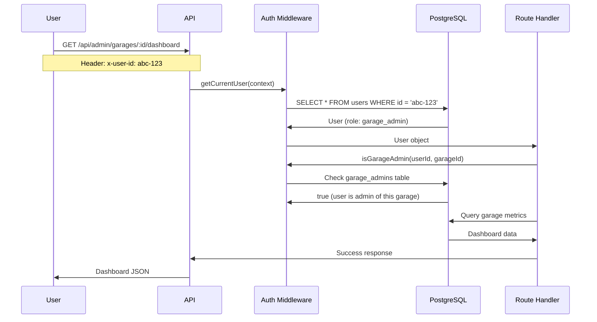

# Role-Based Access Control (RBAC) for Garage Admins

## 🎯 Overview

**VendPark now supports Role-Based Access Control with garage administrators!**

Garage admins can manage their assigned garages and access reporting dashboards without having full system access.

## 👥 User Roles

### 1. **`user`** (Default)
- Regular customers who subscribe to parking passes
- Can view their own subscriptions
- Cannot access admin endpoints

### 2. **`garage_admin`**
- Can manage one or more assigned garages
- Access to garage-specific dashboards and reports
- Cannot create other admins or access unassigned garages

### 3. **`super_admin`**
- Full system access
- Can manage all garages
- Can assign and remove garage admins
- Access to all endpoints

## 📊 Database Schema

### Users Table (Updated)

```sql
CREATE TABLE users (
  id UUID PRIMARY KEY,
  first_name VARCHAR(255) NOT NULL,
  last_name VARCHAR(255) NOT NULL,
  email VARCHAR(255) NOT NULL UNIQUE,
  phone VARCHAR(50),
  stripe_customer_id VARCHAR(255),
  role user_role NOT NULL DEFAULT 'user',  -- NEW
  created_at TIMESTAMP NOT NULL DEFAULT NOW(),
  updated_at TIMESTAMP NOT NULL DEFAULT NOW()
);
```

### Garage Admins Junction Table

```sql
CREATE TABLE garage_admins (
  id UUID PRIMARY KEY,
  user_id UUID NOT NULL REFERENCES users(id) ON DELETE CASCADE,
  garage_id UUID NOT NULL REFERENCES garages(id) ON DELETE CASCADE,
  assigned_by UUID REFERENCES users(id),
  assigned_at TIMESTAMP NOT NULL DEFAULT NOW(),
  permissions JSONB DEFAULT '{"view_reports": true, "manage_passes": true, "manage_subscriptions": true}',
  created_at TIMESTAMP NOT NULL DEFAULT NOW(),
  UNIQUE(user_id, garage_id)
);
```

## 🔧 PostgreSQL Functions

### `is_garage_admin(user_id, garage_id)`

Checks if a user is admin of a specific garage:

```sql
SELECT is_garage_admin(
  'user-uuid',
  'garage-uuid'
); -- Returns true or false
```

### `get_managed_garages(user_id)`

Returns all garage IDs managed by a user:

```sql
SELECT * FROM get_managed_garages('user-uuid');
-- Returns garage_id column for all managed garages
```

## 🚀 API Endpoints

### Authentication

**All admin endpoints require authentication via `x-user-id` header:**

```bash
curl -H "x-user-id: YOUR_USER_ID" http://localhost:3000/api/admin/my-garages
```

> ⚠️ **Production Note**: Replace header-based auth with JWT/session validation

### 1. Get Managed Garages

**`GET /api/admin/my-garages`**

Returns all garages managed by the authenticated user.

**Access:** `garage_admin`, `super_admin`

```bash
curl -H "x-user-id: admin-uuid" \
  http://localhost:3000/api/admin/my-garages
```

**Response:**
```json
{
  "success": true,
  "message": "Managed garages retrieved",
  "data": [
    {
      "id": "garage-1-uuid",
      "name": "Downtown Parking",
      "address": "123 Main St",
      "active": true,
      "createdAt": "2025-01-01T00:00:00.000Z"
    },
    {
      "id": "garage-2-uuid",
      "name": "Airport Parking",
      "address": "456 Airport Rd",
      "active": true,
      "createdAt": "2025-01-15T00:00:00.000Z"
    }
  ]
}
```

### 2. Get Garage Dashboard

**`GET /api/admin/garages/:id/dashboard`**

Returns comprehensive dashboard data for a specific garage.

**Access:** `garage_admin` (for assigned garages only), `super_admin`

```bash
curl -H "x-user-id: admin-uuid" \
  http://localhost:3000/api/admin/garages/garage-uuid/dashboard
```

**Response:**
```json
{
  "success": true,
  "data": {
    "garage": {
      "id": "garage-uuid",
      "name": "Downtown Parking",
      "address": "123 Main St"
    },
    "metrics": {
      "activeSubscriptions": 45,
      "monthlyRecurringRevenue": 6750.00,
      "currentMonthPayments": 42,
      "currentMonthRevenue": 6300.00,
      "totalPasses": 3,
      "activePasses": 2
    },
    "passes": [
      {
        "id": "pass-uuid",
        "name": "Monthly Pass",
        "monthlyAmount": "150.00",
        "active": true,
        "subscriptions": 30
      },
      {
        "id": "pass-uuid-2",
        "name": "Premium Pass",
        "monthlyAmount": "200.00",
        "active": true,
        "subscriptions": 15
      }
    ]
  }
}
```

### 3. Get Garage P&L Report

**`GET /api/admin/garages/:id/reports/pl`**

Returns profit and loss report for a garage with optional date filtering.

**Access:** `garage_admin` (for assigned garages only), `super_admin`

```bash
# Current year
curl -H "x-user-id: admin-uuid" \
  "http://localhost:3000/api/admin/garages/garage-uuid/reports/pl"

# Date range
curl -H "x-user-id: admin-uuid" \
  "http://localhost:3000/api/admin/garages/garage-uuid/reports/pl?startDate=2025-01-01&endDate=2025-03-31"
```

**Response:**
```json
{
  "success": true,
  "data": {
    "garage": {
      "id": "garage-uuid",
      "name": "Downtown Parking",
      "address": "123 Main St"
    },
    "period": {
      "startDate": "2025-01-01T00:00:00.000Z",
      "endDate": "2025-03-31T23:59:59.999Z"
    },
    "financials": {
      "totalRevenue": 20250.00,
      "totalFees": 810.00,
      "netRevenue": 19440.00,
      "paymentCount": 135
    }
  }
}
```

### 4. Assign Garage Admin

**`POST /api/admin/garage-admins`**

Assigns a user as admin of a garage.

**Access:** `super_admin` only

```bash
curl -X POST \
  -H "x-user-id: super-admin-uuid" \
  -H "Content-Type: application/json" \
  -d '{
    "userId": "user-uuid",
    "garageId": "garage-uuid",
    "permissions": "{\"view_reports\": true, \"manage_passes\": true}"
  }' \
  http://localhost:3000/api/admin/garage-admins
```

**Response:**
```json
{
  "success": true,
  "message": "Garage admin assigned successfully",
  "data": {
    "id": "assignment-uuid",
    "userId": "user-uuid",
    "garageId": "garage-uuid",
    "assignedBy": "super-admin-uuid",
    "assignedAt": "2025-01-20T10:30:00.000Z",
    "permissions": "{\"view_reports\": true, \"manage_passes\": true}"
  }
}
```

## 🔒 Authorization Flow



## 🛡️ Access Control Logic

### Permission Hierarchy

```
super_admin
    ↓ Can access ALL endpoints
    ↓ Can assign/revoke admins
    ↓
garage_admin
    ↓ Can access assigned garage endpoints
    ↓ Cannot access other garages
    ↓
user
    ↓ Can only access own data
    ↓ No admin endpoints
```

### Example Checks

#### Check if User Can Access Garage

```typescript
import { isGarageAdmin } from '@/api/middleware/auth';

const canAccess = await isGarageAdmin(userId, garageId);

if (!canAccess) {
  set.status = 403;
  return forbiddenResponse('You do not have access to this garage');
}
```

#### Check if User Has Role

```typescript
import { hasRole } from '@/api/middleware/auth';

if (!hasRole(user.role, ['super_admin'])) {
  set.status = 403;
  return forbiddenResponse('Super admin access required');
}
```

## 📝 Usage Examples

### Example 1: Assign Garage Admin

```bash
# 1. Create a user (or use existing user ID)
curl -X POST http://localhost:3000/api/users \
  -H "Content-Type: application/json" \
  -d '{
    "firstName": "Jane",
    "lastName": "Smith",
    "email": "jane@downtown-parking.com"
  }'

# 2. Assign as garage admin (super admin only)
curl -X POST http://localhost:3000/api/admin/garage-admins \
  -H "x-user-id: SUPER_ADMIN_UUID" \
  -H "Content-Type: application/json" \
  -d '{
    "userId": "jane-uuid",
    "garageId": "downtown-garage-uuid"
  }'
```

### Example 2: Admin Views Their Garages

```bash
# Jane logs in and views her managed garages
curl -H "x-user-id: jane-uuid" \
  http://localhost:3000/api/admin/my-garages

# Returns only garages Jane manages
```

### Example 3: Admin Checks Dashboard

```bash
# View dashboard for assigned garage
curl -H "x-user-id: jane-uuid" \
  http://localhost:3000/api/admin/garages/downtown-garage-uuid/dashboard

# Success: Jane manages this garage

# Try to access different garage
curl -H "x-user-id: jane-uuid" \
  http://localhost:3000/api/admin/garages/airport-garage-uuid/dashboard

# Error 403: Jane doesn't manage Airport Parking
```

## 🔐 Error Responses

### 401 Unauthorized
```json
{
  "success": false,
  "error": "Unauthorized: Authentication required"
}
```

**Cause:** No `x-user-id` header or invalid user ID

### 403 Forbidden
```json
{
  "success": false,
  "error": "Forbidden: Insufficient permissions"
}
```

**Cause:** User doesn't have required role or garage access

### 404 Not Found
```json
{
  "success": false,
  "error": "Garage not found"
}
```

**Cause:** Garage ID doesn't exist

## 🚀 Migration & Setup

### Apply RBAC Migration

```bash
# Run migration script
bun run scripts/apply-rbac-migration.ts

# Or apply manually
bun run drizzle-kit push:pg
```

### Create Your First Super Admin

```sql
-- Update an existing user to super admin
UPDATE users
SET role = 'super_admin'
WHERE email = 'admin@vend.com';
```

### Assign Garage Admins

```bash
# Use the API endpoint
curl -X POST http://localhost:3000/api/admin/garage-admins \
  -H "x-user-id: SUPER_ADMIN_UUID" \
  -H "Content-Type: application/json" \
  -d '{
    "userId": "manager-uuid",
    "garageId": "garage-uuid"
  }'
```

## 📊 Multi-Garage Admin

A single user can manage multiple garages:

```sql
-- Assign Jane to multiple garages
INSERT INTO garage_admins (user_id, garage_id, assigned_by)
VALUES
  ('jane-uuid', 'downtown-uuid', 'super-admin-uuid'),
  ('jane-uuid', 'midtown-uuid', 'super-admin-uuid'),
  ('jane-uuid', 'uptown-uuid', 'super-admin-uuid');
```

```bash
# Jane can now access all three garages
curl -H "x-user-id: jane-uuid" \
  http://localhost:3000/api/admin/my-garages

# Returns: Downtown, Midtown, Uptown garages
```

## ✅ Benefits

### 1. **Security**
- Least-privilege access
- Garage-level data isolation
- Audit trail (assignedBy, assignedAt)

### 2. **Scalability**
- Support multiple garage operators
- Delegate management responsibilities
- Centralized user management

### 3. **Flexibility**
- Custom permissions per admin (JSON field)
- Multi-garage assignments
- Easy role upgrades/downgrades

### 4. **Type Safety**
- Full TypeScript support
- Compile-time role checks
- Database-level constraints

## 🎯 Production Considerations

### Replace Mock Authentication

```typescript
// ❌ Current (development only)
const userId = context.request.headers.get('x-user-id');

// ✅ Production
import jwt from 'jsonwebtoken';

const token = context.request.headers.get('authorization')?.replace('Bearer ', '');
const decoded = jwt.verify(token, process.env.JWT_SECRET);
const userId = decoded.userId;
```

### Add Row-Level Security (PostgreSQL)

```sql
-- Enable RLS on sensitive tables
ALTER TABLE garage_admins ENABLE ROW LEVEL SECURITY;

CREATE POLICY "admins_view_own_assignments"
ON garage_admins
FOR SELECT
USING (user_id = current_user_id());
```

### Logging & Monitoring

```typescript
// Log admin actions
console.log({
  action: 'garage_admin_assigned',
  assignedBy: superAdmin.id,
  assignedTo: newAdmin.id,
  garage: garage.id,
  timestamp: new Date(),
});
```

## 📚 Summary

**RBAC System for VendPark:**

1. **Three Roles:** user, garage_admin, super_admin
2. **Four New Endpoints:** my-garages, dashboard, P&L, assign-admin
3. **Garage-Level Access:** Admins only see their garages
4. **Full Type Safety:** TypeScript + PostgreSQL enums
5. **Production-Ready:** Easy to extend with JWT/OAuth

**One migration adds complete access control!** 🎉

