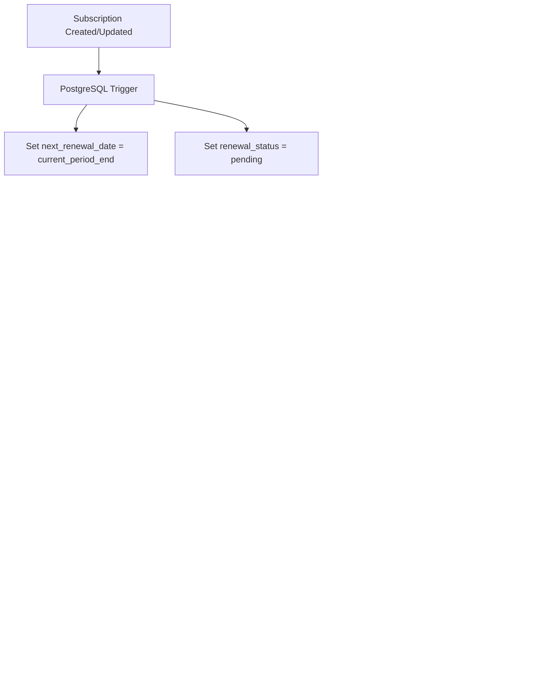

# Subscription Renewal System

## Overview

The VendPark subscription renewal system automatically tracks and processes subscription renewals using **PostgreSQL triggers** and **Stripe integration**. This ensures subscriptions are kept in sync with Stripe and provides proactive renewal management.

## Architecture



## Database Schema

### New Columns Added to `subscriptions` Table

| Column                 | Type        | Description                                                          |
| ---------------------- | ----------- | -------------------------------------------------------------------- |
| `renewal_status`       | varchar(50) | Tracks renewal state: `pending`, `processing`, `completed`, `failed` |
| `renewal_attempted_at` | timestamp   | When the last renewal attempt was made                               |
| `next_renewal_date`    | timestamp   | Automatically set to `current_period_end`                            |

### Database Functions

#### `update_next_renewal_date()`

**Trigger Function** - Automatically updates `next_renewal_date` when:

- A new subscription is created
- `current_period_end` changes
- Subscription status changes

```sql
-- Automatically triggered on INSERT or UPDATE
CREATE TRIGGER subscription_renewal_trigger
    BEFORE INSERT OR UPDATE OF current_period_end, status
    ON subscriptions
    FOR EACH ROW
    EXECUTE FUNCTION update_next_renewal_date();
```

#### `find_expiring_subscriptions(days_ahead)`

**Query Function** - Finds subscriptions that need renewal:

```sql
SELECT * FROM find_expiring_subscriptions(7);  -- Find subscriptions expiring in 7 days
```

Returns:

- `subscription_id`
- `user_id`
- `pass_id`
- `garage_id`
- `stripe_subscription_id`
- `days_until_expiry`

## API Endpoints

### 1. Process All Expiring Renewals

```http
POST /api/subscriptions/process-renewals?daysAhead=7
```

**Query Parameters:**

- `daysAhead` (optional, default: 7) - Process subscriptions expiring within N days

**Response:**

```json
{
  "success": true,
  "message": "Processed 5 subscription renewals",
  "data": {
    "processed": 5,
    "results": [
      {
        "subscriptionId": "uuid",
        "userId": "uuid",
        "status": "renewed",
        "newPeriodEnd": "2025-12-01T00:00:00Z"
      }
    ]
  }
}
```

### 2. Renew Specific Subscription

```http
POST /api/subscriptions/:id/renew
```

**Response:**

```json
{
  "success": true,
  "message": "Subscription renewed successfully",
  "data": {
    "subscriptionId": "uuid",
    "userId": "uuid",
    "status": "renewed",
    "newPeriodEnd": "2025-12-01T00:00:00Z"
  }
}
```

## How It Works

### 1. Automatic Tracking

When a subscription is created or updated, the database trigger automatically:

- Sets `next_renewal_date` to `current_period_end`
- Sets `renewal_status` to `pending`

### 2. Renewal Processing

The renewal service:

1. **Queries** for expiring subscriptions using `find_expiring_subscriptions()`
2. **Updates** status to `processing`
3. **Fetches** latest subscription data from Stripe
4. **Syncs** period dates and status from Stripe
5. **Updates** `renewal_status` to `completed` or `failed`

### 3. Stripe Integration

Stripe automatically handles subscription billing. Our system:

- **Doesn't create** new charges (Stripe does this)
- **Syncs** the updated billing period dates
- **Detects** cancellations
- **Updates** our database to match Stripe's state

## Cron Job Setup (Recommended)

Set up a cron job to automatically process renewals:

### Using Unix Cron

```bash
# Run daily at 3 AM to check subscriptions expiring in next 7 days
0 3 * * * curl -X POST http://localhost:3000/api/subscriptions/process-renewals?daysAhead=7
```

### Using Node/Bun Scheduler

```typescript
import { processSubscriptionRenewals } from '@/billing/subscription-renewal';

// Run every day at 3 AM
setInterval(async () => {
  const now = new Date();
  if (now.getHours() === 3 && now.getMinutes() === 0) {
    await processSubscriptionRenewals(7);
  }
}, 60000); // Check every minute
```

### Using External Service

- **Vercel Cron**: Add to `vercel.json`
- **AWS EventBridge**: Schedule Lambda invocation
- **GitHub Actions**: Scheduled workflow
- **Render Cron Jobs**: Built-in cron support

## Manual Testing

### 1. Check Expiring Subscriptions

```sql
-- Find subscriptions expiring in next 30 days
SELECT * FROM find_expiring_subscriptions(30);
```

### 2. Trigger Manual Renewal

```bash
# Process all renewals
curl -X POST "http://localhost:3000/api/subscriptions/process-renewals?daysAhead=30"

# Renew specific subscription
curl -X POST "http://localhost:3000/api/subscriptions/{subscription-id}/renew"
```

### 3. Check Renewal Status

```bash
# Get subscription with renewal fields
curl "http://localhost:3000/api/subscriptions/{subscription-id}" | jq '{
  id,
  status,
  currentPeriodEnd,
  renewalStatus,
  nextRenewalDate,
  renewalAttemptedAt
}'
```

## Renewal Status States

| Status       | Description                 |
| ------------ | --------------------------- |
| `pending`    | Awaiting renewal processing |
| `processing` | Currently being renewed     |
| `completed`  | Successfully renewed        |
| `failed`     | Renewal failed (check logs) |

## Error Handling

### Failed Renewals

When a renewal fails:

1. Status set to `failed`
2. Error logged to console
3. Can be retried manually via API

### Common Failure Reasons

- **No Stripe ID**: Subscription missing `stripe_subscription_id`
- **Stripe Error**: Network issue, API key invalid, or subscription deleted
- **Canceled Subscription**: User canceled in Stripe but not reflected in DB

## Best Practices

1. **Run Renewals Daily**: Check 7 days ahead to catch issues early
2. **Monitor Failed Renewals**: Set up alerts for `renewal_status = 'failed'`
3. **Webhook Integration**: Use Stripe webhooks for real-time updates (recommended)
4. **Grace Period**: Process renewals 7-14 days before expiry for buffer time
5. **Logging**: Monitor renewal logs for patterns and issues

## Future Enhancements

- [ ] Email notifications before renewal
- [ ] Retry failed renewals automatically
- [ ] Stripe webhook integration for real-time sync
- [ ] Admin dashboard for renewal monitoring
- [ ] Custom renewal rules per garage

## Related Files

- **Migration**: `drizzle/migrations/0001_subscription_renewal_trigger.sql`
- **Service**: `src/billing/subscription-renewal.ts`
- **Schema**: `src/database/schema.ts`
- **API Routes**: `src/api/index.ts`
