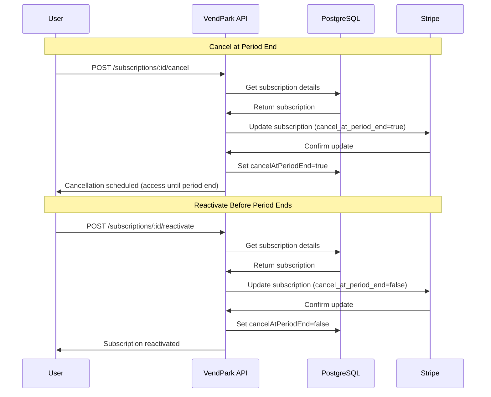
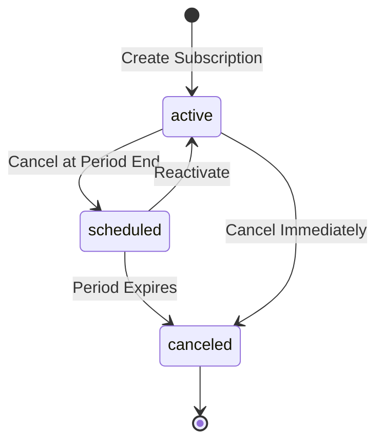

# Subscription Cancellation System

## Overview

The VendPark subscription cancellation system provides flexible options for users to cancel their parking subscriptions with **Stripe integration** and proper **grace period handling**.

## Cancellation Types

### 1. Cancel at Period End (User-Friendly) ✅ Recommended
**Endpoint:** `POST /api/subscriptions/:id/cancel`

- User keeps access until end of paid period
- Automatically syncs with Stripe
- Can be reactivated before period ends
- No refunds necessary

### 2. Cancel Immediately (Admin Action) ⚠️
**Endpoint:** `POST /api/subscriptions/:id/cancel-immediately`

- Immediate cancellation
- User loses access right away
- Typically used for violations or admin overrides

### 3. Reactivate Subscription
**Endpoint:** `POST /api/subscriptions/:id/reactivate`

- Restores subscription scheduled for cancellation
- Only works before period ends
- Resumes automatic renewals

## Architecture



## API Endpoints

### 1. Cancel Subscription at Period End

```http
POST /api/subscriptions/:id/cancel
```

**Parameters:**
- `id` (path) - Subscription UUID

**Response:**
```json
{
  "success": true,
  "message": "Subscription will be cancelled on 12/1/2025. You will retain access until then.",
  "data": {
    "subscriptionId": "uuid",
    "userId": "uuid",
    "status": "scheduled_for_cancellation",
    "cancelAtPeriodEnd": true,
    "currentPeriodEnd": "2025-12-01T00:00:00Z"
  }
}
```

**Error Cases:**
- `404` - Subscription not found
- `400` - Subscription already cancelled

### 2. Reactivate Subscription

```http
POST /api/subscriptions/:id/reactivate
```

**Parameters:**
- `id` (path) - Subscription UUID

**Response:**
```json
{
  "success": true,
  "message": "Subscription reactivated successfully. It will continue to renew.",
  "data": {
    "subscriptionId": "uuid",
    "userId": "uuid",
    "status": "cancelled",
    "cancelAtPeriodEnd": false,
    "currentPeriodEnd": "2025-12-01T00:00:00Z"
  }
}
```

**Error Cases:**
- `404` - Subscription not found
- `400` - Subscription not scheduled for cancellation
- `400` - Subscription already ended

### 3. Cancel Subscription Immediately (Admin)

```http
POST /api/subscriptions/:id/cancel-immediately
```

**Parameters:**
- `id` (path) - Subscription UUID

**Response:**
```json
{
  "success": true,
  "message": "Subscription cancelled immediately. Access has been revoked.",
  "data": {
    "subscriptionId": "uuid",
    "userId": "uuid",
    "status": "cancelled",
    "cancelAtPeriodEnd": false
  }
}
```

## User Flow Examples

### Scenario 1: User Cancels, Then Changes Mind

```bash
# 1. User cancels subscription
curl -X POST "http://localhost:3000/api/subscriptions/{sub-id}/cancel"
# Response: "Will be cancelled on 12/1/2025. You retain access until then."

# 2. User still has access to parking
# cancelAtPeriodEnd = true
# status = "active"
# Access works normally until 12/1/2025

# 3. User changes mind and reactivates
curl -X POST "http://localhost:3000/api/subscriptions/{sub-id}/reactivate"
# Response: "Subscription reactivated. It will continue to renew."

# 4. Subscription continues normally
# cancelAtPeriodEnd = false
# Will auto-renew on 12/1/2025
```

### Scenario 2: User Cancels and Lets It Expire

```bash
# 1. User cancels subscription
curl -X POST "http://localhost:3000/api/subscriptions/{sub-id}/cancel"
# cancelAtPeriodEnd = true

# 2. User continues using parking until period end
# Access works normally

# 3. Period ends (12/1/2025)
# Renewal cron job runs
# Stripe marks subscription as "canceled"
# Our system syncs: status = "canceled"

# 4. User loses access after 12/1/2025
# Cannot reactivate (must create new subscription)
```

### Scenario 3: Admin Immediate Cancellation

```bash
# Admin cancels subscription immediately (policy violation, etc.)
curl -X POST "http://localhost:3000/api/subscriptions/{sub-id}/cancel-immediately"

# Subscription immediately set to "canceled"
# User loses access right away
# No grace period
```

## Database Schema

### Subscription Status Flow



### Key Fields

| Field | Type | Description |
| --- | --- | --- |
| `status` | enum | `active`, `canceled`, `past_due`, etc. |
| `cancelAtPeriodEnd` | boolean | If `true`, will cancel when period ends |
| `canceledAt` | timestamp | When subscription was cancelled |
| `currentPeriodEnd` | timestamp | When current access expires |

## Stripe Integration

### Cancel at Period End
```typescript
// Sets cancel_at_period_end = true in Stripe
await stripe.subscriptions.update(subscriptionId, {
  cancel_at_period_end: true
});
```

### Reactivate
```typescript
// Removes cancellation schedule in Stripe
await stripe.subscriptions.update(subscriptionId, {
  cancel_at_period_end: false
});
```

### Cancel Immediately
```typescript
// Permanently cancels subscription in Stripe
await stripe.subscriptions.cancel(subscriptionId);
```

## User Permission Considerations

### Recommended Implementation

```typescript
// In a real app, add user authentication middleware
app.post('/api/subscriptions/:id/cancel', async ({ params, user }) => {
  const subscription = await getSubscription(params.id);
  
  // Ensure user owns the subscription
  if (subscription.userId !== user.id && !user.isAdmin) {
    return errorResponse('Unauthorized', 403);
  }
  
  return await cancelSubscription(params.id);
});
```

### Access Control Matrix

| Endpoint | User (Own Sub) | User (Other Sub) | Admin |
| --- | --- | --- | --- |
| Cancel at Period End | ✅ Allow | ❌ Deny | ✅ Allow |
| Reactivate | ✅ Allow | ❌ Deny | ✅ Allow |
| Cancel Immediately | ❌ Deny | ❌ Deny | ✅ Allow |

## Error Handling

### Common Errors

| Error | Cause | Solution |
| --- | --- | --- |
| `Subscription not found` | Invalid ID | Check subscription exists |
| `Already cancelled` | Status is "canceled" | Cannot modify cancelled subs |
| `Already scheduled` | Already has cancel_at_period_end=true | Use reactivate instead |
| `Not scheduled` | Trying to reactivate active sub | No action needed |
| `Stripe error` | Network/API issue | Retry or check Stripe dashboard |

## Testing

### Manual Testing

```bash
# Get a subscription ID
SUB_ID=$(curl -s http://localhost:3000/api/subscriptions | jq -r '.data[0].id')

# Test cancellation
curl -X POST "http://localhost:3000/api/subscriptions/$SUB_ID/cancel"

# Verify cancelAtPeriodEnd is true
curl "http://localhost:3000/api/subscriptions/$SUB_ID" | jq '.data.cancelAtPeriodEnd'

# Test reactivation
curl -X POST "http://localhost:3000/api/subscriptions/$SUB_ID/reactivate"

# Verify cancelAtPeriodEnd is false
curl "http://localhost:3000/api/subscriptions/$SUB_ID" | jq '.data.cancelAtPeriodEnd'
```

### Integration Test

```typescript
import { test, expect } from 'bun:test';

test('cancel and reactivate subscription', async () => {
  // Create test subscription
  const sub = await createTestSubscription();
  
  // Cancel it
  const cancelRes = await fetch(`/api/subscriptions/${sub.id}/cancel`, {
    method: 'POST'
  });
  const cancelData = await cancelRes.json();
  expect(cancelData.data.cancelAtPeriodEnd).toBe(true);
  
  // Reactivate it
  const reactivateRes = await fetch(`/api/subscriptions/${sub.id}/reactivate`, {
    method: 'POST'
  });
  const reactivateData = await reactivateRes.json();
  expect(reactivateData.data.cancelAtPeriodEnd).toBe(false);
});
```

## Best Practices

### 1. Always Use "Cancel at Period End" for Users
- Provides better UX
- Avoids refund complications
- Gives users time to reconsider

### 2. Notify Users Before Cancellation Takes Effect
```typescript
// Send email reminder 3 days before cancellation
if (subscription.cancelAtPeriodEnd) {
  const daysUntilEnd = daysBetween(now, subscription.currentPeriodEnd);
  if (daysUntilEnd === 3) {
    await sendCancellationReminderEmail(user);
  }
}
```

### 3. Allow Easy Reactivation
- Show "Reactivate" button in UI if `cancelAtPeriodEnd === true`
- Make reactivation one-click
- No penalty for changing mind

### 4. Log All Cancellations
```typescript
await db.insert(auditLog).values({
  action: 'subscription_cancelled',
  userId: subscription.userId,
  subscriptionId: subscription.id,
  reason: 'user_requested',
  timestamp: new Date()
});
```

## Frontend Integration

### React Example

```tsx
function SubscriptionCard({ subscription }) {
  const [isCancelling, setIsCancelling] = useState(false);
  
  const handleCancel = async () => {
    const response = await fetch(
      `/api/subscriptions/${subscription.id}/cancel`,
      { method: 'POST' }
    );
    
    if (response.ok) {
      alert('Subscription will be cancelled at period end');
      // Refresh subscription data
    }
  };
  
  const handleReactivate = async () => {
    const response = await fetch(
      `/api/subscriptions/${subscription.id}/reactivate`,
      { method: 'POST' }
    );
    
    if (response.ok) {
      alert('Subscription reactivated!');
      // Refresh subscription data
    }
  };
  
  return (
    <div>
      <h3>{subscription.pass.name}</h3>
      <p>Status: {subscription.status}</p>
      
      {subscription.cancelAtPeriodEnd ? (
        <>
          <p className="warning">
            Cancels on {new Date(subscription.currentPeriodEnd).toLocaleDateString()}
          </p>
          <button onClick={handleReactivate}>
            Reactivate Subscription
          </button>
        </>
      ) : (
        <button onClick={handleCancel}>
          Cancel Subscription
        </button>
      )}
    </div>
  );
}
```

## Related Files

- **Service**: `src/billing/subscription-cancellation.ts`
- **API Routes**: `src/api/index.ts` (lines 932-1009)
- **Schema**: `src/database/schema.ts`
- **Renewal System**: `RENEWAL_SYSTEM.md`

## Future Enhancements

- [ ] Cancellation reasons tracking
- [ ] Retention offers (discount before cancelling)
- [ ] Cancellation feedback survey
- [ ] Automatic win-back campaigns
- [ ] Partial refunds for immediate cancellations
- [ ] Grace period extensions for loyal customers

