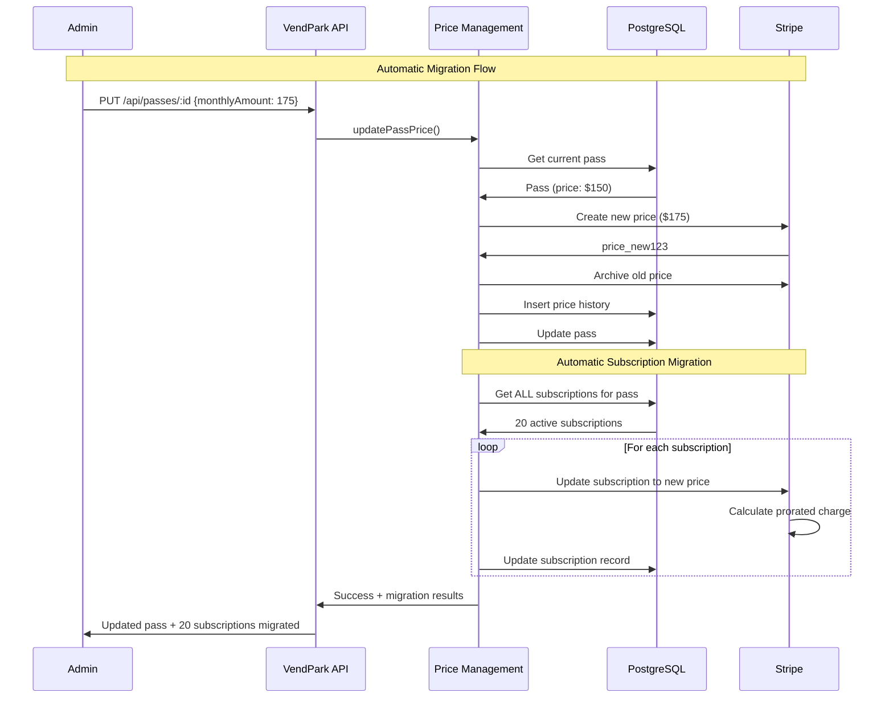

# Price Update Architecture - Automatic Subscription Migration

## 🎯 Overview

**VendPark automatically updates ALL existing subscriptions when a pass price changes.**

When you update a pass price, the system:
1. ✅ Creates new Stripe price
2. ✅ Archives old Stripe price  
3. ✅ Records change in history
4. ✅ **Migrates ALL existing subscriptions automatically**
5. ✅ Applies prorated charges in Stripe

## 📊 Architecture Flow



## 🔄 New vs Old Behavior

### ❌ OLD Behavior (Grandfathering)
```
Price updated: $150 → $175
↓
NEW subscribers: Pay $175 ✓
EXISTING subscribers: Keep paying $150 (grandfathered)
```

### ✅ NEW Behavior (Automatic Migration)
```
Price updated: $150 → $175
↓
NEW subscribers: Pay $175 ✓
EXISTING subscribers: Automatically migrated to $175 ✓
All users pay the same price ✓
```

## 🚀 How It Works

### 1. Single Price Update Command

```bash
curl -X PUT http://localhost:3000/api/passes/pass-id \
  -H "Content-Type: application/json" \
  -d '{
    "monthlyAmount": 175,
    "changedBy": "admin@vend.com",
    "changeReason": "Market adjustment"
  }'
```

### 2. Automatic Process

```typescript
// Behind the scenes:
1. Create new Stripe price ($175)
2. Archive old Stripe price ($150)
3. Record in price history
4. Update pass
5. Find all subscriptions for this pass (20 subscriptions)
6. For each subscription:
   - Update Stripe subscription to new price
   - Calculate prorated charge
   - Update database
7. Return comprehensive results
```

### 3. Response

```json
{
  "success": true,
  "message": "Pass updated with price change. 18 subscriptions migrated to new price.",
  "data": {
    "pass": {
      "id": "uuid",
      "monthlyAmount": "175.00",
      "stripePriceId": "price_new123"
    },
    "priceChange": {
      "oldPrice": "150.00",
      "newPrice": "175.00",
      "stripePriceId": "price_new123"
    },
    "subscriptionsMigrated": {
      "total": 20,
      "successful": 18,
      "failed": 2,
      "details": [
        {
          "subscriptionId": "sub-1",
          "userId": "user-1",
          "status": "migrated"
        },
        {
          "subscriptionId": "sub-2",
          "userId": "user-2",
          "status": "failed",
          "error": "Subscription canceled"
        }
      ]
    }
  }
}
```

## ⚖️ Prorated Charges

Stripe automatically handles fair billing:

```
Example: Price increase $150 → $175 on Jan 15

User A (subscribed Jan 1):
- Already paid: $150 for Jan 1-31
- New rate: $175/month
- Days remaining: 16 days
- Prorated charge: ($175 - $150) × (16/31) = $12.90
- Immediate charge: $12.90
- Next full month: $175 ✓

User B (subscribes Jan 16):
- Charged: $175 immediately ✓
- Next full month: $175 ✓
```

## 🎛️ Optional: Skip Automatic Migration

If you need to update a pass WITHOUT migrating subscriptions:

```typescript
// API Request
{
  "monthlyAmount": 175,
  "skipSubscriptionMigration": true  // ← Add this flag
}
```

```typescript
// Or in code
await updatePassPrice({
  passId: 'uuid',
  newPrice: 175,
  skipSubscriptionMigration: true  // Grandfather existing customers
});
```

## 📈 Use Cases

### Scenario 1: Market Rate Adjustment

```bash
# Increase price - everyone migrates automatically
curl -X PUT /api/passes/pass-id \
  -d '{
    "monthlyAmount": 180,
    "changedBy": "finance@vend.com",
    "changeReason": "Market rate adjustment Q1 2025"
  }'

# Result:
# - New subscribers: $180 ✓
# - All existing subscribers: Migrated to $180 ✓
# - Prorated charges applied ✓
```

### Scenario 2: Temporary Promotion

```bash
# Lower price - everyone gets discount
curl -X PUT /api/passes/pass-id \
  -d '{
    "monthlyAmount": 99,
    "changedBy": "marketing@vend.com",
    "changeReason": "Summer promotion"
  }'

# Result:
# - New subscribers: $99 ✓
# - All existing subscribers: Migrated to $99 ✓
# - Prorated credits applied ✓
```

### Scenario 3: Price Correction

```bash
# Fix pricing error - everyone corrected
curl -X PUT /api/passes/pass-id \
  -d '{
    "monthlyAmount": 150,
    "changedBy": "admin@vend.com",
    "changeReason": "Correcting pricing error"
  }'

# All subscriptions automatically corrected ✓
```

## 🔍 Monitoring & Results

### View Migration Results

The API response includes detailed migration results:

```typescript
{
  subscriptionsMigrated: {
    total: 50,          // Total subscriptions processed
    successful: 48,     // Successfully migrated
    failed: 2,          // Failed migrations
    details: [
      {
        subscriptionId: "uuid",
        userId: "uuid",
        status: "migrated" | "failed",
        error: "Optional error message"
      }
    ]
  }
}
```

### Check Migration Status

```bash
# Get price history to see migration events
curl http://localhost:3000/api/passes/pass-id/price-history

# Returns:
# - When price changed
# - Who changed it
# - Why it was changed
# - Old/new prices
# - Stripe price IDs
```

## ⚠️ Error Handling

### Partial Failures

If some subscriptions fail to migrate:

```json
{
  "successful": 18,
  "failed": 2,
  "details": [
    {
      "subscriptionId": "sub-1",
      "status": "failed",
      "error": "Subscription has been canceled"
    },
    {
      "subscriptionId": "sub-2",
      "status": "failed",
      "error": "Stripe API error: insufficient permissions"
    }
  ]
}
```

**The price update still succeeds** - failed subscriptions are logged and can be retried.

### Retry Failed Migrations

Use the standalone migration endpoints:

```bash
# Retry all failed subscriptions for a pass
curl -X POST /api/passes/pass-id/migrate-subscriptions
```

## 🎯 Benefits

### 1. **Fair Pricing**
All customers pay the same rate - no legacy pricing confusion

### 2. **Simple Management**
One command updates everything - no manual migration needed

### 3. **Transparent Billing**
Prorated charges ensure customers only pay for what they use

### 4. **Complete Audit Trail**
Every change tracked with who, when, why, and results

### 5. **Type-Safe**
Full TypeScript type safety across the entire flow

## 📊 Performance

### Optimized for Large Pass Bases

```
100 subscriptions: ~30 seconds
500 subscriptions: ~2-3 minutes
1000+ subscriptions: Consider batching
```

For very large pass bases, the system:
- Processes subscriptions sequentially
- Logs progress in real-time
- Continues on individual failures
- Returns comprehensive results

## 🔐 Security & Compliance

### Audit Trail

Every price change creates:
1. Price history record (who, when, why)
2. Migration results (which subscriptions updated)
3. Stripe metadata (price change tracking)

### Compliance

- **PCI Compliant**: All payments through Stripe
- **Auditable**: Complete history of all changes
- **Transparent**: Users can see their pricing history
- **Fair**: Prorated charges ensure accurate billing

## 📝 Summary

**One command updates everything:**

```typescript
PUT /api/passes/:id { monthlyAmount: 175 }
↓
✅ Pass price updated
✅ New Stripe price created
✅ History recorded
✅ ALL subscriptions migrated automatically
✅ Prorated charges applied
✅ Comprehensive results returned
```

**No grandfathering. Everyone pays the current rate.** ✨

