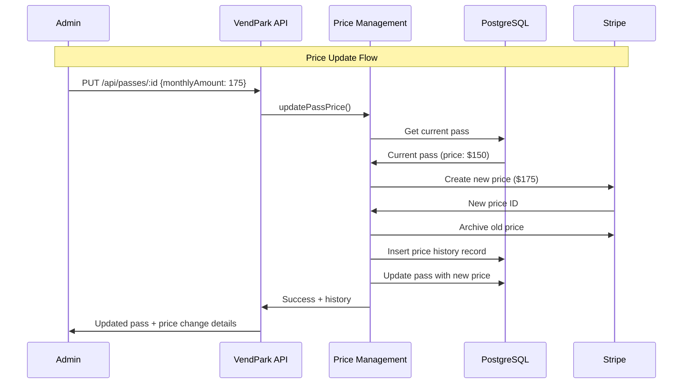

# Pass Price Management & History Tracking

## Overview

The VendPark pass price management system provides comprehensive price change tracking with **automatic Stripe synchronization** and **complete audit history**. Every price change is recorded with who made it, when, and why.

## Key Features

✅ **Automatic Stripe Price Creation** - New prices are created in Stripe automatically  
✅ **Price History Tracking** - Complete audit trail of all price changes  
✅ **Immutable Stripe Prices** - Old prices are archived, new prices are created  
✅ **Metadata Tracking** - Record who changed the price and why  
✅ **Seamless Integration** - Works automatically when updating passes  

## Architecture



## Database Schema

### `pass_price_history` Table

| Column | Type | Description |
|--------|------|-------------|
| `id` | UUID | Primary key |
| `pass_id` | UUID | Reference to pass |
| `old_price` | DECIMAL(10,2) | Previous price (null for initial) |
| `new_price` | DECIMAL(10,2) | New price |
| `old_stripe_price_id` | VARCHAR(255) | Previous Stripe price ID |
| `new_stripe_price_id` | VARCHAR(255) | New Stripe price ID |
| `changed_by` | VARCHAR(255) | Who made the change |
| `change_reason` | TEXT | Why the change was made |
| `effective_date` | TIMESTAMP | When change took effect |
| `created_at` | TIMESTAMP | When record was created |

**Indexes:**
- `pass_id` - Fast lookups by pass
- `effective_date` - Chronological queries

## API Endpoints

### 1. Update Pass (with Price Change Tracking)

```http
PUT /api/passes/:id
Content-Type: application/json

{
  "monthlyAmount": 175,
  "changedBy": "admin@vend.com",
  "changeReason": "Market adjustment for Q1 2025"
}
```

**Response:**
```json
{
  "success": true,
  "message": "Pass updated successfully with price change tracked",
  "data": {
    "pass": {
      "id": "uuid",
      "name": "Downtown Parking - Basic Monthly",
      "monthlyAmount": "175.00",
      "stripePriceId": "price_new123",
      "stripeProductId": "prod_abc",
      ...
    },
    "priceChange": {
      "oldPrice": "150.00",
      "newPrice": "175.00",
      "stripePriceId": "price_new123"
    }
  }
}
```

**What Happens:**
1. ✅ Creates new Stripe price at $175
2. ✅ Archives old Stripe price ($150)
3. ✅ Records change in history table
4. ✅ Updates pass with new price
5. ✅ Returns complete change details

### 2. Get Pass Price History

```http
GET /api/passes/:id/price-history
```

**Response:**
```json
{
  "success": true,
  "message": "Price history retrieved",
  "data": [
    {
      "id": "hist-uuid-1",
      "passId": "pass-uuid",
      "oldPrice": null,
      "newPrice": "150.00",
      "oldStripePriceId": null,
      "newStripePriceId": "price_old123",
      "changedBy": "system",
      "changeReason": "Initial price",
      "effectiveDate": "2025-01-01T00:00:00Z",
      "createdAt": "2025-01-01T00:00:00Z"
    },
    {
      "id": "hist-uuid-2",
      "passId": "pass-uuid",
      "oldPrice": "150.00",
      "newPrice": "175.00",
      "oldStripePriceId": "price_old123",
      "newStripePriceId": "price_new123",
      "changedBy": "admin@vend.com",
      "changeReason": "Market adjustment for Q1 2025",
      "effectiveDate": "2025-03-01T00:00:00Z",
      "createdAt": "2025-03-01T00:00:00Z"
    }
  ]
}
```

## Price Management Service

### `updatePassPrice(params)`

**Parameters:**
```typescript
{
  passId: string;
  newPrice: number;
  changedBy?: string;        // Optional: who made the change
  changeReason?: string;      // Optional: why the change was made
  effectiveDate?: Date;       // Optional: when change takes effect (default: now)
}
```

**Returns:**
```typescript
Result<{
  pass: Pass;
  priceHistory: PassPriceHistory;
  oldPrice: string;
  newPrice: string;
  newStripePriceId?: string;
}>
```

**Validation:**
- ✅ Checks pass exists
- ✅ Verifies price actually changed
- ✅ Creates Stripe price if pass has Stripe product
- ✅ Archives old Stripe price
- ✅ Records history before updating pass

### `getPassPriceHistory(passId)`

Returns complete chronological history of price changes for a pass.

### `getPassPriceAtDate(passId, date)`

Returns the price that was in effect on a specific date (useful for reporting).

## Stripe Integration

### How Stripe Prices Work

Stripe prices are **immutable** - you cannot change them. When updating a price:

1. ✅ Create a new Stripe price object
2. ✅ Archive the old price (`active: false`)
3. ✅ Update the pass to use new price ID

**Stripe Price Metadata:**
```javascript
{
  passId: "uuid",
  previousPrice: "150.00",
  priceChangeDate: "2025-03-01T00:00:00.000Z"
}
```

### Existing Subscriptions

**Important:** Existing subscriptions continue using their current price. To update subscriptions:

```typescript
// Option 1: Update subscription to new price
await stripe.subscriptions.update(subscriptionId, {
  items: [{
    id: subscriptionItemId,
    price: newPriceId
  }]
});

// Option 2: Let subscriptions renew at new price
// (Automatic on next renewal if you update the default price)
```

## Use Cases

### Scenario 1: Market Adjustment

```bash
# Increase price due to market conditions
curl -X PUT http://localhost:3000/api/passes/pass-id \
  -H "Content-Type: application/json" \
  -d '{
    "monthlyAmount": 175,
    "changedBy": "finance@vend.com",
    "changeReason": "Market rate adjustment for Q1 2025"
  }'
```

### Scenario 2: Promotional Discount

```bash
# Temporary price reduction
curl -X PUT http://localhost:3000/api/passes/pass-id \
  -H "Content-Type: application/json" \
  -d '{
    "monthlyAmount": 99,
    "changedBy": "marketing@vend.com",
    "changeReason": "Summer promotion - 34% off"
  }'
```

### Scenario 3: Correcting an Error

```bash
# Fix incorrect pricing
curl -X PUT http://localhost:3000/api/passes/pass-id \
  -H "Content-Type: application/json" \
  -d '{
    "monthlyAmount": 150,
    "changedBy": "admin@vend.com",
    "changeReason": "Correcting pricing error"
  }'
```

## Reporting & Analytics

### Price Change Report

```sql
-- Get all price changes in last 30 days
SELECT 
  p.name AS pass_name,
  pph.old_price,
  pph.new_price,
  (pph.new_price - pph.old_price) AS price_difference,
  ((pph.new_price - pph.old_price) / pph.old_price * 100) AS percent_change,
  pph.changed_by,
  pph.change_reason,
  pph.effective_date
FROM pass_price_history pph
JOIN passes p ON p.id = pph.pass_id
WHERE pph.created_at >= NOW() - INTERVAL '30 days'
ORDER BY pph.effective_date DESC;
```

### Average Price Over Time

```sql
-- Price trends per garage
SELECT 
  g.name AS garage_name,
  DATE_TRUNC('month', pph.effective_date) AS month,
  AVG(pph.new_price) AS avg_monthly_price
FROM pass_price_history pph
JOIN passes p ON p.id = pph.pass_id
JOIN garages g ON g.id = p.garage_id
GROUP BY g.name, DATE_TRUNC('month', pph.effective_date)
ORDER BY month DESC, g.name;
```

## Best Practices

### 1. Always Provide Context

```typescript
// Good ✅
updatePassPrice({
  passId: 'uuid',
  newPrice: 175,
  changedBy: 'admin@vend.com',
  changeReason: 'Competitor analysis showed market rate at $180'
});

// Bad ❌
updatePassPrice({
  passId: 'uuid',
  newPrice: 175
});
```

### 2. Communicate Price Changes

```typescript
// After updating price, notify affected users
const result = await updatePassPrice(params);

if (result.success) {
  // Get active subscriptions
  const activeSubscribers = await getSubscribersByPass(passId);
  
  // Send notifications
  await sendPriceChangeNotification(activeSubscribers, {
    oldPrice: result.data.oldPrice,
    newPrice: result.data.newPrice,
    effectiveDate: params.effectiveDate
  });
}
```

### 3. Schedule Price Changes

```typescript
// Set future effective date
updatePassPrice({
  passId: 'uuid',
  newPrice: 200,
  effectiveDate: new Date('2025-04-01'),
  changedBy: 'finance@vend.com',
  changeReason: 'Q2 2025 pricing adjustment'
});
```

### 4. Monitor Price History

```typescript
// Regular audit of pricing changes
const history = await getPassPriceHistory(passId);

// Alert on suspicious changes
const suspiciousChanges = history.filter(h => {
  const percentChange = ((parseFloat(h.newPrice) - parseFloat(h.oldPrice!)) / parseFloat(h.oldPrice!)) * 100;
  return Math.abs(percentChange) > 50; // More than 50% change
});
```

## Testing

### Manual Testing

```bash
# 1. Get a pass
PASS_ID=$(curl -s http://localhost:3000/api/passes | jq -r '.data[0].id')

# 2. Update price
curl -X PUT "http://localhost:3000/api/passes/$PASS_ID" \
  -H "Content-Type: application/json" \
  -d '{
    "monthlyAmount": 199,
    "changedBy": "test@vend.com",
    "changeReason": "Testing price change"
  }' | jq '.'

# 3. Check history
curl "http://localhost:3000/api/passes/$PASS_ID/price-history" | jq '.'

# 4. Verify Stripe
# Check Stripe dashboard for new price creation
```

### Integration Test

```typescript
import { test, expect } from 'bun:test';

test('price update creates history and Stripe price', async () => {
  const pass = await createTestPass({ monthlyAmount: 150 });
  
  const result = await updatePassPrice({
    passId: pass.id,
    newPrice: 175,
    changedBy: 'test@example.com',
    changeReason: 'Test price change'
  });
  
  expect(result.success).toBe(true);
  expect(result.data.oldPrice).toBe('150.00');
  expect(result.data.newPrice).toBe('175.00');
  expect(result.data.newStripePriceId).toBeDefined();
  
  // Verify history
  const history = await getPassPriceHistory(pass.id);
  expect(history.data).toHaveLength(1);
  expect(history.data[0].changeReason).toBe('Test price change');
});
```

## Migration Applied

✅ **Migration:** `0002_pass_price_history.sql`  
✅ **Table Created:** `pass_price_history`  
✅ **Indexes Created:** `pass_id`, `effective_date`  
✅ **Schema Updated:** Added `PassPriceHistory` type exports

## Related Files

- **Migration**: `drizzle/migrations/0002_pass_price_history.sql`
- **Service**: `src/billing/pass-price-management.ts`
- **Schema**: `src/database/schema.ts` (lines 101-124)
- **API Routes**: `src/api/routes/passes.ts` (updated PUT, new GET)

## Future Enhancements

- [ ] Scheduled price changes (cron job)
- [ ] Bulk price updates across multiple passes
- [ ] Price change preview/dry-run mode
- [ ] Email notifications for price changes
- [ ] Price rollback functionality
- [ ] Price change approval workflow
- [ ] Analytics dashboard for price trends
- [ ] Automatic subscription price updates on renewal

---

**Your pass pricing system now has enterprise-grade audit capabilities!** 🎉

