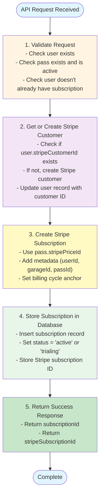
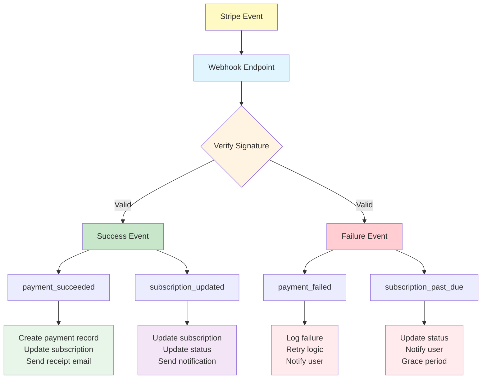
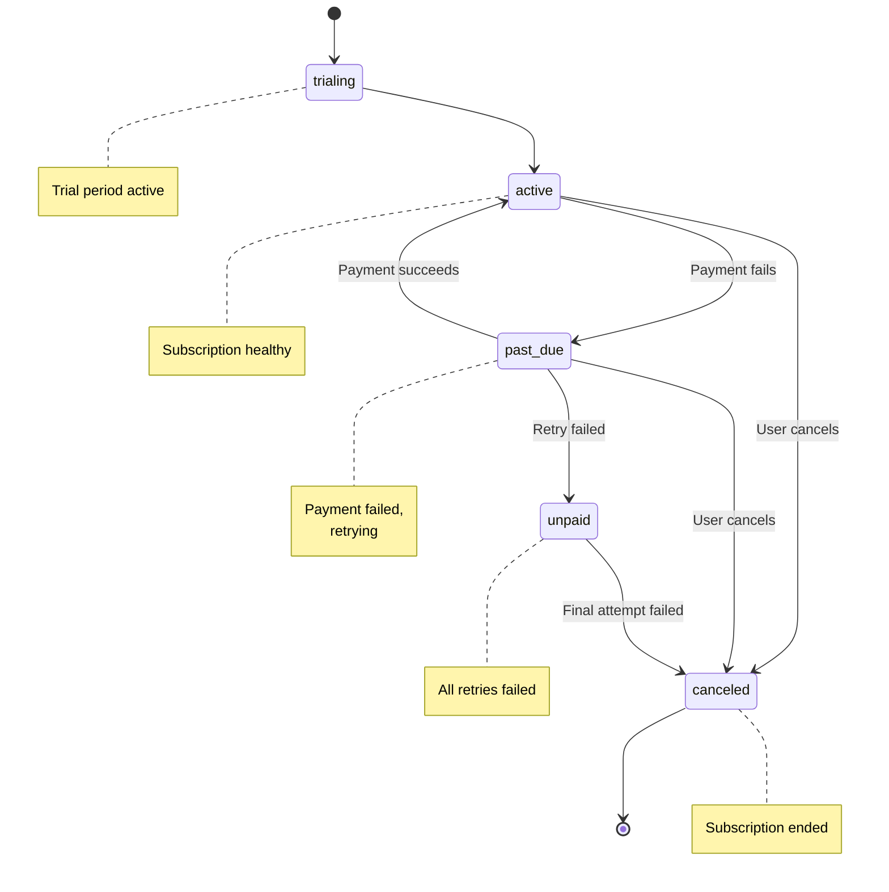

# Billing Lifecycle Documentation

## Overview

This document describes the complete lifecycle of a subscription from creation to cancellation, including payment processing and error handling.

## Subscription Creation Flow

### 1. User Initiates Subscription

```
User Dashboard → Select Pass → Click "Subscribe"
```

### 2. API Request Flow

```typescript
POST /api/billing/subscribe
{
  "userId": "uuid",
  "passId": "uuid"
}
```

### 3. Backend Processing



### 4. Error Handling

```typescript
// Possible errors and recovery
try {
  // Create subscription
} catch (error) {
  if (error.type === 'StripeCardError') {
    // Card declined - notify user
    return errorResponse('Payment method declined');
  }
  
  if (error.type === 'StripeInvalidRequestError') {
    // Invalid request - log and alert
    logger.error('Invalid Stripe request', { error, userId, passId });
    return errorResponse('Unable to process subscription');
  }
  
  // Rollback any created resources
  if (stripeCustomerId && !existingCustomer) {
    await stripe.customers.del(stripeCustomerId);
  }
  
  throw error;
}
```

## Monthly Billing Process

### How Stripe Handles Renewals

Stripe automatically handles recurring billing:

1. **Subscription Created** (Day 0)
   - Initial payment collected
   - `current_period_start` = now
   - `current_period_end` = now + 30 days

2. **Pre-renewal** (Day 27-28)
   - Stripe sends `invoice.upcoming` webhook
   - Opportunity to update subscription or notify user

3. **Renewal Day** (Day 30)
   - Stripe creates invoice
   - Attempts to charge payment method
   - Sends `invoice.payment_succeeded` or `invoice.payment_failed`

4. **Post-renewal**
   - Update subscription period dates
   - Record payment in database
   - Continue for next period

### Webhook Flow Diagram



## Payment Success Flow

### Webhook: `invoice.payment_succeeded`

```typescript
async function handlePaymentSucceeded(invoice: Stripe.Invoice) {
  // 1. Extract data from invoice
  const {
    subscription: stripeSubscriptionId,
    amount_paid: amount,
    charge,
  } = invoice;
  
  // 2. Get subscription from database
  const [subscription] = await db
    .select()
    .from(subscriptions)
    .where(eq(subscriptions.stripeSubscriptionId, stripeSubscriptionId));
  
  if (!subscription) {
    logger.error('Subscription not found', { stripeSubscriptionId });
    return;
  }
  
  // 3. Calculate fees
  const chargeData = await stripe.charges.retrieve(charge as string);
  const stripeFee = chargeData.balance_transaction.fee / 100;
  const netAmount = amount / 100 - stripeFee;
  
  // 4. Create payment record
  await db.insert(payments).values({
    stripePaymentIntentId: chargeData.payment_intent,
    subscriptionId: subscription.id,
    garageId: subscription.garageId,
    amount: (amount / 100).toString(),
    stripeFee: stripeFee.toString(),
    netAmount: netAmount.toString(),
    status: 'succeeded',
    currency: invoice.currency,
    paymentDate: new Date(invoice.created * 1000),
  });
  
  // 5. Update subscription period
  await db
    .update(subscriptions)
    .set({
      currentPeriodStart: new Date(invoice.period_start * 1000),
      currentPeriodEnd: new Date(invoice.period_end * 1000),
      status: 'active',
    })
    .where(eq(subscriptions.id, subscription.id));
  
  // 6. Send receipt (future)
  await sendReceiptEmail(subscription.userId, invoice.id);
  
  logger.info('Payment processed successfully', {
    subscriptionId: subscription.id,
    amount: amount / 100,
  });
}
```

## Payment Failure Flow

### Webhook: `invoice.payment_failed`

```typescript
async function handlePaymentFailed(invoice: Stripe.Invoice) {
  const { subscription: stripeSubscriptionId, attempt_count } = invoice;
  
  // 1. Get subscription
  const [subscription] = await db
    .select()
    .from(subscriptions)
    .where(eq(subscriptions.stripeSubscriptionId, stripeSubscriptionId));
  
  if (!subscription) {
    return;
  }
  
  // 2. Update subscription status
  await db
    .update(subscriptions)
    .set({
      status: 'past_due',
    })
    .where(eq(subscriptions.id, subscription.id));
  
  // 3. Determine action based on attempt
  if (attempt_count === 1) {
    // First failure - send friendly reminder
    await sendPaymentFailedEmail(subscription.userId, {
      type: 'reminder',
      nextRetry: '3 days',
    });
  } else if (attempt_count === 2) {
    // Second failure - urgent notice
    await sendPaymentFailedEmail(subscription.userId, {
      type: 'urgent',
      nextRetry: '5 days',
    });
  } else if (attempt_count >= 3) {
    // Third failure - final notice
    await sendPaymentFailedEmail(subscription.userId, {
      type: 'final',
      action: 'Update payment method or subscription will be canceled',
    });
  }
  
  logger.warn('Payment failed', {
    subscriptionId: subscription.id,
    attemptCount: attempt_count,
  });
}
```

### Stripe Retry Logic

Stripe automatically retries failed payments:

- **Day 0**: Initial attempt fails
- **Day 3**: First retry
- **Day 5**: Second retry
- **Day 7**: Third retry
- **Day 9**: Fourth retry (final)

After final retry failure:
- Subscription status → `unpaid` or `canceled`
- Customer loses access

### Grace Period Strategy

```typescript
// Custom grace period logic
async function checkGracePeriod(subscriptionId: string) {
  const [subscription] = await db
    .select()
    .from(subscriptions)
    .where(eq(subscriptions.id, subscriptionId));
  
  if (subscription.status !== 'past_due') {
    return;
  }
  
  const daysSinceFailure = daysBetween(
    subscription.currentPeriodEnd,
    new Date()
  );
  
  if (daysSinceFailure > 14) {
    // Cancel after 14-day grace period
    await cancelSubscription(subscriptionId, 'payment_failed');
    await revokeAccess(subscription.userId, subscription.garageId);
  }
}
```

## Cancellation Flow

### User-Initiated Cancellation

```typescript
async function cancelSubscription(
  subscriptionId: string,
  cancelImmediately: boolean = false
) {
  // 1. Get subscription
  const [subscription] = await db
    .select()
    .from(subscriptions)
    .where(eq(subscriptions.id, subscriptionId));
  
  if (!subscription) {
    throw new Error('Subscription not found');
  }
  
  // 2. Cancel in Stripe
  if (cancelImmediately) {
    await stripe.subscriptions.cancel(subscription.stripeSubscriptionId);
  } else {
    // Cancel at period end (default)
    await stripe.subscriptions.update(subscription.stripeSubscriptionId, {
      cancel_at_period_end: true,
    });
  }
  
  // 3. Update database
  await db
    .update(subscriptions)
    .set({
      status: cancelImmediately ? 'canceled' : subscription.status,
      cancelAtPeriodEnd: !cancelImmediately,
      canceledAt: cancelImmediately ? new Date() : null,
    })
    .where(eq(subscriptions.id, subscriptionId));
  
  // 4. If immediate, revoke access
  if (cancelImmediately) {
    await revokeAccess(subscription.userId, subscription.garageId);
  }
  
  // 5. Send confirmation
  await sendCancellationEmail(subscription.userId, {
    immediate: cancelImmediately,
    endDate: subscription.currentPeriodEnd,
  });
  
  logger.info('Subscription canceled', {
    subscriptionId,
    immediate: cancelImmediately,
  });
}
```

### Webhook: `customer.subscription.deleted`

```typescript
async function handleSubscriptionDeleted(subscription: Stripe.Subscription) {
  // Update database
  await db
    .update(subscriptions)
    .set({
      status: 'canceled',
      canceledAt: new Date(),
    })
    .where(eq(subscriptions.stripeSubscriptionId, subscription.id));
  
  // Revoke access
  const [sub] = await db
    .select()
    .from(subscriptions)
    .where(eq(subscriptions.stripeSubscriptionId, subscription.id));
  
  if (sub) {
    await revokeAccess(sub.userId, sub.garageId);
  }
}
```

## Subscription Status Lifecycle



## Refund Process

### Full Refund

```typescript
async function processRefund(paymentId: string, reason: string) {
  // 1. Get payment record
  const [payment] = await db
    .select()
    .from(payments)
    .where(eq(payments.id, paymentId));
  
  if (!payment) {
    throw new Error('Payment not found');
  }
  
  // 2. Create Stripe refund
  const refund = await stripe.refunds.create({
    payment_intent: payment.stripePaymentIntentId,
    reason: reason === 'duplicate' ? 'duplicate' : 'requested_by_customer',
    metadata: {
      paymentId,
      subscriptionId: payment.subscriptionId,
    },
  });
  
  // 3. Update payment record
  await db
    .update(payments)
    .set({
      status: 'refunded',
    })
    .where(eq(payments.id, paymentId));
  
  // 4. Notify user
  await sendRefundEmail(payment.subscriptionId, payment.amount);
  
  logger.info('Refund processed', { paymentId, amount: payment.amount });
  
  return refund;
}
```

## Proration Handling

### Upgrade/Downgrade Mid-cycle

```typescript
async function changeSubscriptionPass(
  subscriptionId: string,
  newPassId: string
) {
  const [subscription] = await db
    .select()
    .from(subscriptions)
    .where(eq(subscriptions.id, subscriptionId));
  
  const [newPass] = await db
    .select()
    .from(passes)
    .where(eq(passes.id, newPassId));
  
  // Stripe handles proration automatically
  await stripe.subscriptions.update(subscription.stripeSubscriptionId, {
    items: [
      {
        id: subscription.stripeItemId, // Need to store this
        price: newPass.stripePriceId,
      },
    ],
    proration_behavior: 'create_prorations', // or 'always_invoice'
  });
  
  // Update database
  await db
    .update(subscriptions)
    .set({
      passId: newPass.id,
      stripePriceId: newPass.stripePriceId,
      monthlyAmount: newPass.monthlyAmount,
    })
    .where(eq(subscriptions.id, subscriptionId));
}
```

## Reconciliation Process

### Daily Reconciliation Job

```typescript
async function reconcileSubscriptions() {
  // 1. Get all active subscriptions from database
  const dbSubscriptions = await db
    .select()
    .from(subscriptions)
    .where(eq(subscriptions.status, 'active'));
  
  // 2. Check each against Stripe
  for (const sub of dbSubscriptions) {
    const stripeSubscription = await stripe.subscriptions.retrieve(
      sub.stripeSubscriptionId
    );
    
    // 3. Check for discrepancies
    if (sub.status !== stripeSubscription.status) {
      logger.warn('Status mismatch', {
        subscriptionId: sub.id,
        dbStatus: sub.status,
        stripeStatus: stripeSubscription.status,
      });
      
      // Sync from Stripe (source of truth)
      await db
        .update(subscriptions)
        .set({
          status: stripeSubscription.status,
          currentPeriodStart: new Date(
            stripeSubscription.current_period_start * 1000
          ),
          currentPeriodEnd: new Date(
            stripeSubscription.current_period_end * 1000
          ),
        })
        .where(eq(subscriptions.id, sub.id));
    }
  }
}
```

## Best Practices

### 1. Idempotency

```typescript
// Always use idempotency keys for Stripe requests
await stripe.subscriptions.create(
  {
    customer: customerId,
    items: [{ price: priceId }],
  },
  {
    idempotencyKey: `subscription_${userId}_${passId}_${Date.now()}`,
  }
);
```

### 2. Webhook Security

```typescript
// Always verify webhook signatures
const sig = request.headers['stripe-signature'];
let event;

try {
  event = stripe.webhooks.constructEvent(
    request.body,
    sig,
    process.env.STRIPE_WEBHOOK_SECRET
  );
} catch (err) {
  logger.error('Webhook signature verification failed', err);
  return { status: 400, error: 'Webhook Error' };
}
```

### 3. Error Handling

- Always wrap Stripe calls in try-catch
- Log all errors with context
- Return user-friendly error messages
- Implement retry logic for transient failures

### 4. Testing

```typescript
// Use Stripe test mode
const testCustomer = await stripe.customers.create({
  email: 'test@example.com',
  payment_method: 'pm_card_visa', // Test payment method
});

// Trigger test webhooks
await stripe.webhooks.generateTestEvent('invoice.payment_succeeded');
```

## Conclusion

This billing lifecycle ensures:

✅ Reliable subscription creation  
✅ Automatic monthly renewals  
✅ Graceful failure handling  
✅ Flexible cancellation options  
✅ Data consistency between Stripe and database  
✅ Audit trail for all transactions

