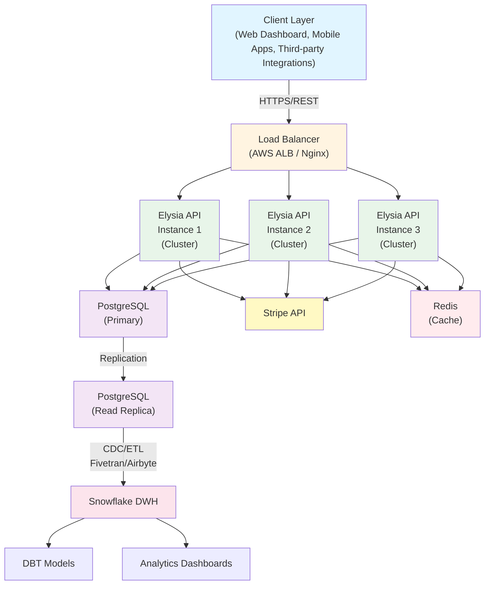
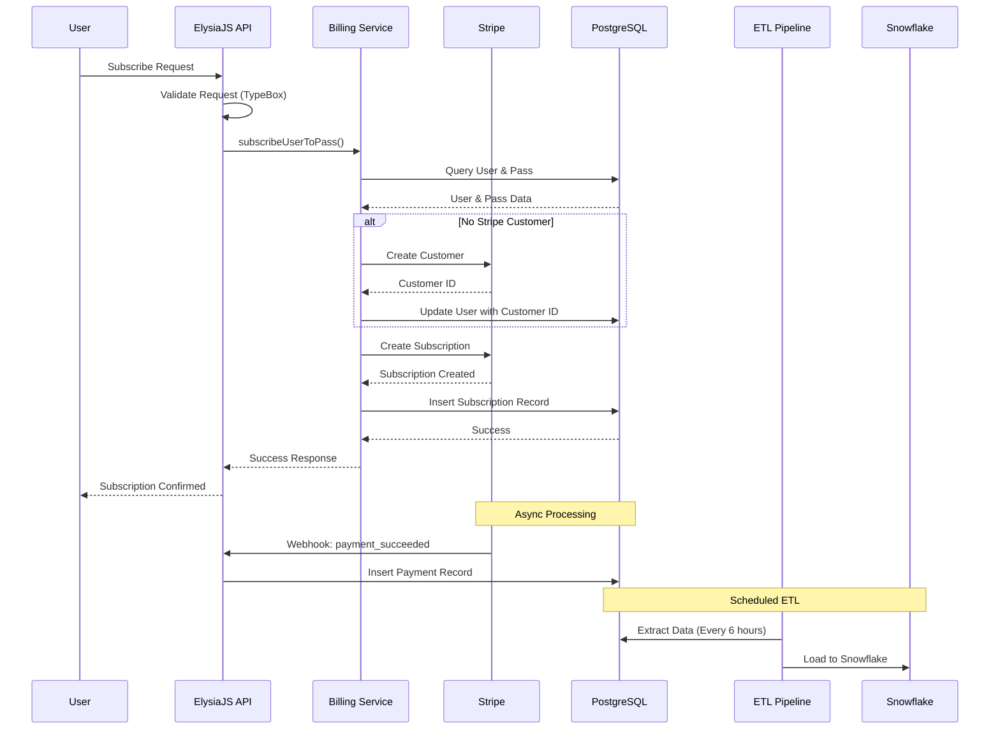
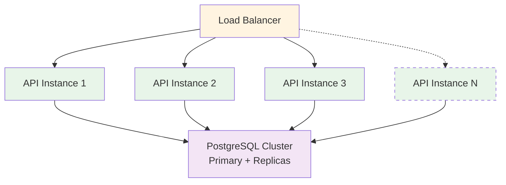
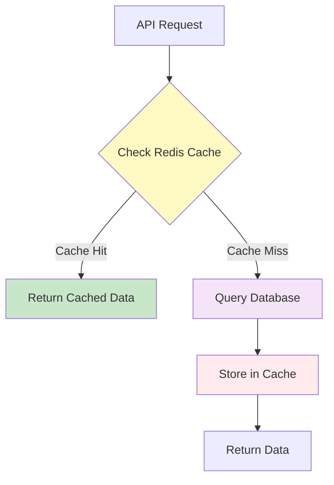

# System Architecture

## Overview

Vend Parking is a multi-tenant billing and reporting system designed for scalability, type safety, and operational excellence.

## Architecture Diagram



## Technology Stack

### Backend

- **Framework**: ElysiaJS 1.1.29
- **Runtime**: Bun (latest)
- **Language**: TypeScript 5.7+ (strict mode)
- **ORM**: Drizzle ORM
- **Database**: PostgreSQL 16
- **Payments**: Stripe API
- **Caching**: Redis (future)

### Data Warehouse

- **Storage**: Snowflake
- **Transformation**: DBT
- **ETL**: Fivetran or Airbyte
- **Sync Frequency**: Every 6 hours

### Infrastructure

- **Containerization**: Docker
- **Orchestration**: Kubernetes (production)
- **CI/CD**: GitHub Actions
- **Monitoring**: Datadog / Grafana

## Data Flow

### 1. User Subscription Flow



### 2. Reporting Flow

```mermaid
graph TB
    subgraph "Simple Reports (Real-time)"
        Dashboard1[Dashboard Request]
        API1[ElysiaJS API]
        Replica[PostgreSQL Read Replica]
        Aggregate[Aggregate Data In-memory]
        Response1[JSON Response]

        Dashboard1 --> API1
        API1 --> Replica
        Replica --> Aggregate
        Aggregate --> Response1
    end

    subgraph "Complex Analytics (Pre-computed)"
        Dashboard2[Dashboard Request]
        API2[ElysiaJS API]
        Snowflake[Snowflake DWH]
        DBT[DBT Pre-computed Reports]
        Response2[Fast Response < 100ms]

        Dashboard2 --> API2
        API2 --> Snowflake
        Snowflake --> DBT
        DBT --> Response2
    end

    style Dashboard1 fill:#e1f5ff
    style Dashboard2 fill:#e1f5ff
    style Snowflake fill:#fce4ec
    style Replica fill:#f3e5f5
    style DBT fill:#fff4e1
```



## Multi-Tenant Architecture

### Strategy

We use **shared database, shared schema** with row-level isolation:

1. **Database Level**
   - All tables include `garage_id` column
   - All queries filter by `garage_id`
   - Indexed for performance

2. **Application Level**

   ```typescript
   // Every query includes garage context
   await db
     .select()
     .from(subscriptions)
     .where(eq(subscriptions.garageId, currentGarageId));
   ```

3. **Future Enhancement**
   - PostgreSQL Row Level Security (RLS) policies
   - Snowflake secure views per garage

### Benefits

✅ Cost-effective (single database)  
✅ Simple backups and maintenance  
✅ Easy to implement

### Considerations

⚠️ Requires careful query review  
⚠️ Performance tuning needed at scale  
⚠️ Single point of failure (mitigated with replicas)

## Type Safety Architecture

### End-to-End Type Flow

```typescript
1. Database Schema (Drizzle)
   ↓ (inferred types)
2. API Layer (Elysia)
   ↓ (validated with TypeBox)
3. Business Logic (TypeScript)
   ↓ (Result<T, E> types)
4. Response (Type-safe JSON)
```

### Example

```typescript
// Database defines the source of truth
export const users = pgTable('users', {
  id: uuid('id').primaryKey(),
  email: varchar('email', { length: 255 }).notNull(),
});

// Auto-inferred types
export type User = typeof users.$inferSelect;
export type NewUser = typeof users.$inferInsert;

// API validates against the schema
app.post(
  '/users',
  async ({ body }) => {
    // body is type-checked at runtime
  },
  {
    body: t.Object({
      email: t.String({ format: 'email' }),
    }),
  }
);

// Business logic uses Result types
async function createUser(data: NewUser): Promise<Result<User>> {
  try {
    const [user] = await db.insert(users).values(data).returning();
    return ok(user);
  } catch (error) {
    return err(error);
  }
}
```

## Performance Optimizations

### 1. Database Indexing

```sql
-- Multi-tenant queries
CREATE INDEX idx_subscriptions_garage_id ON subscriptions(garage_id);

-- Status filtering
CREATE INDEX idx_subscriptions_status ON subscriptions(status);

-- Date range queries
CREATE INDEX idx_payments_payment_date ON payments(payment_date);

-- Composite indexes for common queries
CREATE INDEX idx_subscriptions_garage_status
  ON subscriptions(garage_id, status);
```

### 2. Connection Pooling

```typescript
const sql = postgres(connectionString, {
  max: 10, // Max connections
  idle_timeout: 20, // Close idle connections
  connect_timeout: 10, // Connection timeout
});
```

### 3. Query Optimization

- Use `EXPLAIN ANALYZE` for slow queries
- Avoid N+1 queries with joins
- Use pagination for large result sets
- Implement query result caching

### 4. Multi-Core Utilization

```typescript
// Cluster mode for CPU-bound operations
const numCPUs = os.cpus().length;
for (let i = 0; i < numCPUs; i++) {
  cluster.fork();
}
```

## Scalability Strategy

### Horizontal Scaling



### Database Scaling

1. **Read Replicas**
   - Route analytical queries to replicas
   - Reduce load on primary database

2. **Partitioning**
   - Partition payments table by date
   - Improve query performance for large datasets

3. **Sharding** (future)
   - Shard by garage_id
   - Distribute load across multiple databases

### Caching Strategy



## Security Architecture

### 1. API Security

- **Authentication**: JWT tokens (future)
- **Authorization**: Role-based access control
- **Rate Limiting**: Per IP and per user
- **Input Validation**: TypeBox runtime validation
- **CORS**: Restricted to approved domains

### 2. Database Security

- **Encryption at Rest**: PostgreSQL native encryption
- **Encryption in Transit**: TLS/SSL connections
- **Least Privilege**: Service accounts with minimal permissions
- **Secrets Management**: Environment variables, Vault

### 3. Payment Security

- **PCI Compliance**: Stripe handles card data
- **Test Mode**: Separate test keys for development
- **Webhook Verification**: HMAC signature validation
- **Idempotency**: Stripe idempotency keys

## Monitoring & Observability

### Metrics to Track

1. **API Metrics**
   - Request rate (requests/second)
   - Response time (p50, p95, p99)
   - Error rate (4xx, 5xx)
   - CPU and memory usage

2. **Database Metrics**
   - Query performance
   - Connection pool utilization
   - Replication lag
   - Disk usage

3. **Business Metrics**
   - Subscriptions created
   - Payment success rate
   - Revenue per garage
   - Churn rate

### Logging Strategy

```typescript
// Structured logging
logger.info({
  event: 'subscription_created',
  userId: user.id,
  garageId: garage.id,
  amount: subscription.monthlyAmount,
  timestamp: new Date().toISOString(),
});
```

## Disaster Recovery

### Backup Strategy

1. **Database Backups**
   - Automated daily backups
   - Point-in-time recovery (PITR)
   - Backup retention: 30 days

2. **Stripe Data**
   - Stripe handles data durability
   - Sync critical data to our database
   - Periodic reconciliation

### Recovery Procedures

1. **Database Failure**
   - Promote read replica to primary
   - Update connection strings
   - RTO: < 5 minutes

2. **API Failure**
   - Auto-scaling replaces failed instances
   - Health checks detect failures
   - RTO: < 1 minute

## Cost Analysis

### Monthly Operating Costs (Estimated)

| Service          | Cost       | Notes                        |
| ---------------- | ---------- | ---------------------------- |
| PostgreSQL (RDS) | $300       | db.t3.medium with replicas   |
| API (EC2/ECS)    | $200       | 3 t3.medium instances        |
| Snowflake        | $500       | Small warehouse, 500GB data  |
| ETL (Fivetran)   | $300       | Based on data volume         |
| Stripe           | Variable   | 2.9% + $0.30 per transaction |
| Monitoring       | $100       | Datadog Pro plan             |
| **Total**        | **$1,400** | Excludes Stripe fees         |

### Cost Optimization

1. Use reserved instances for predictable workloads
2. Auto-scale API instances based on traffic
3. Optimize Snowflake warehouse usage
4. Implement caching to reduce database load
