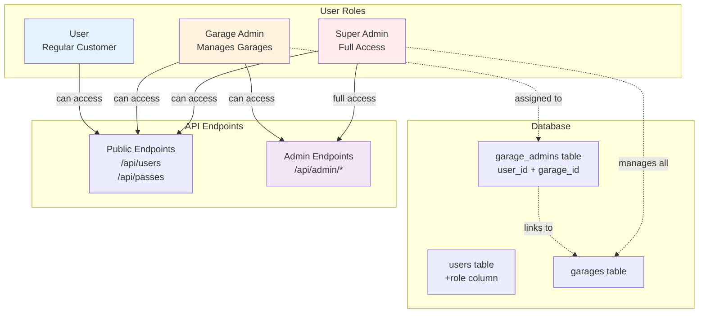
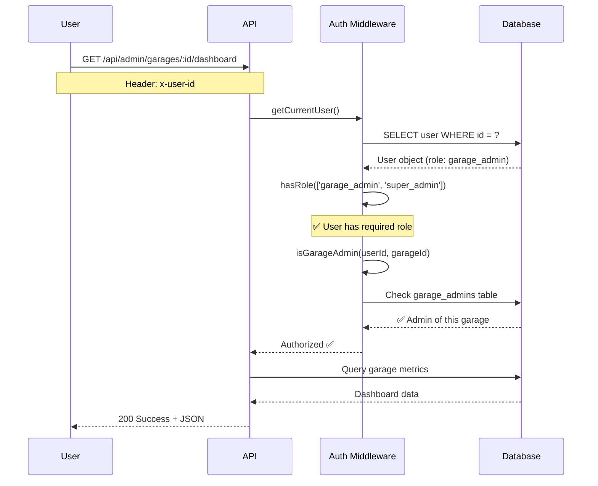
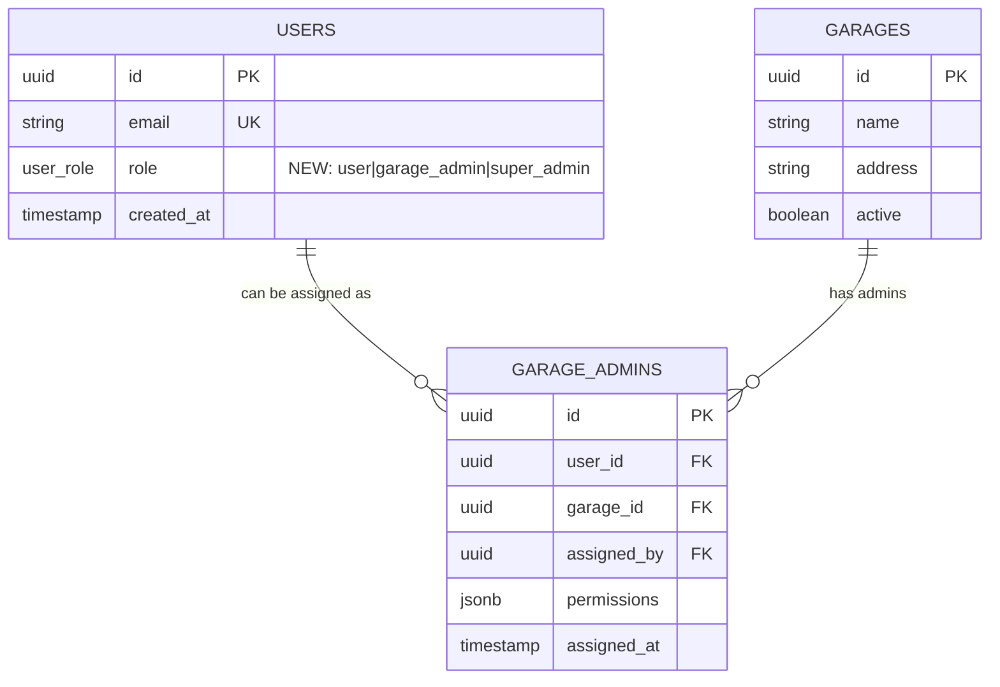
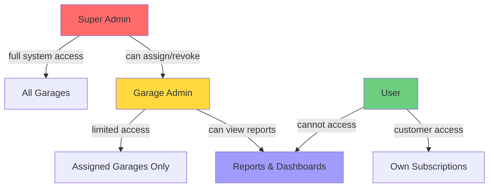
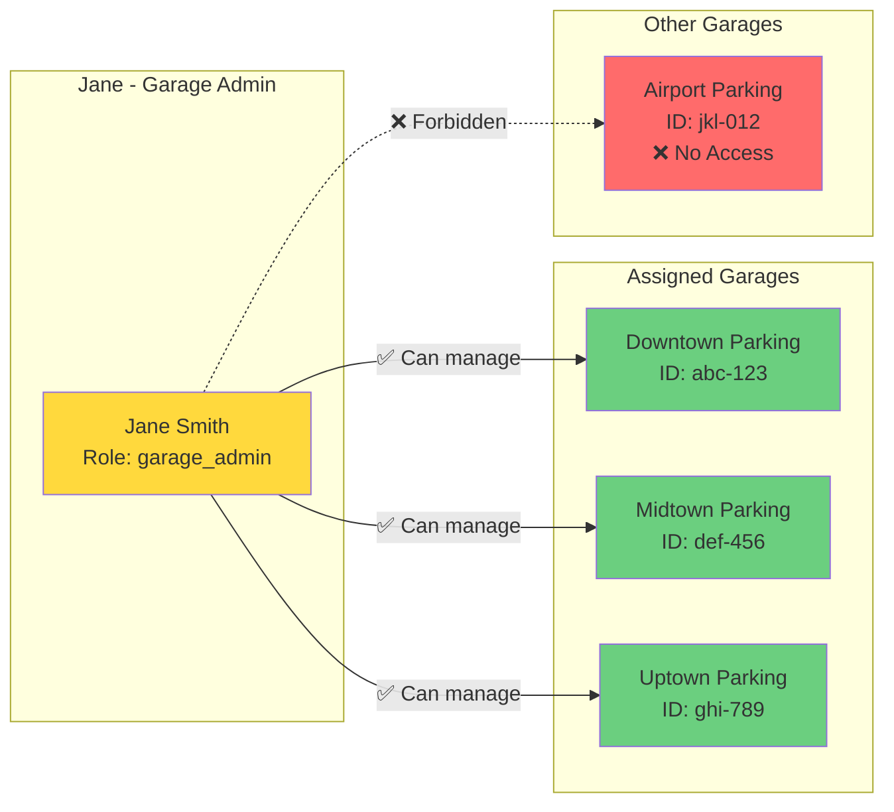
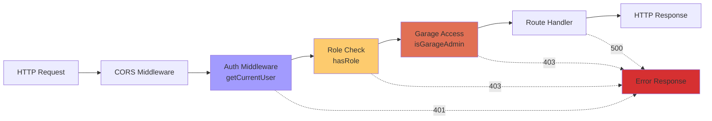
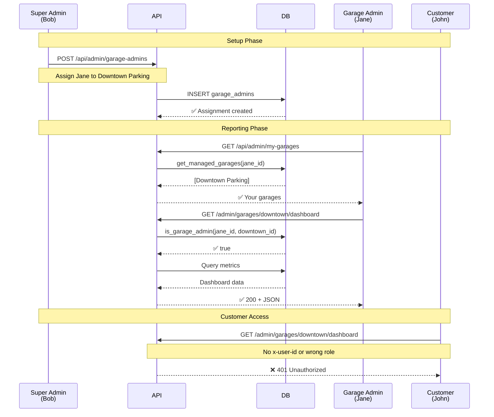
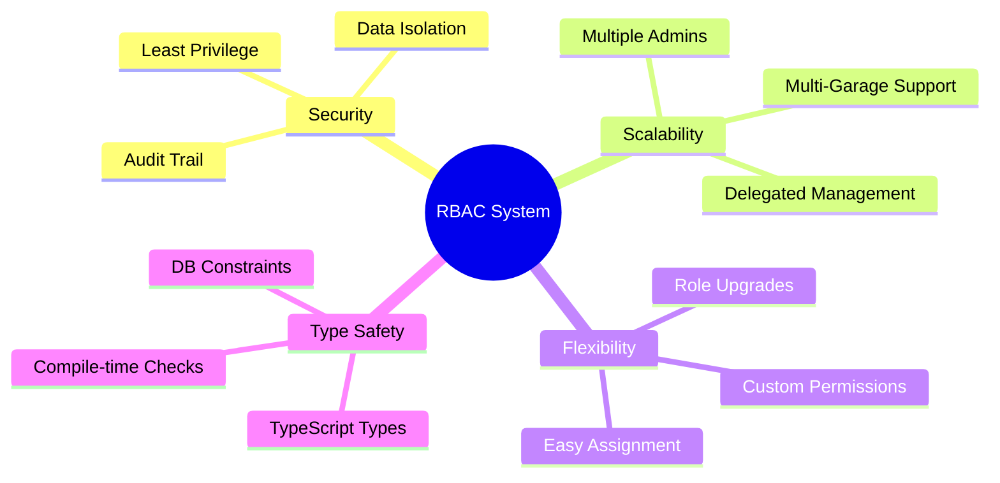
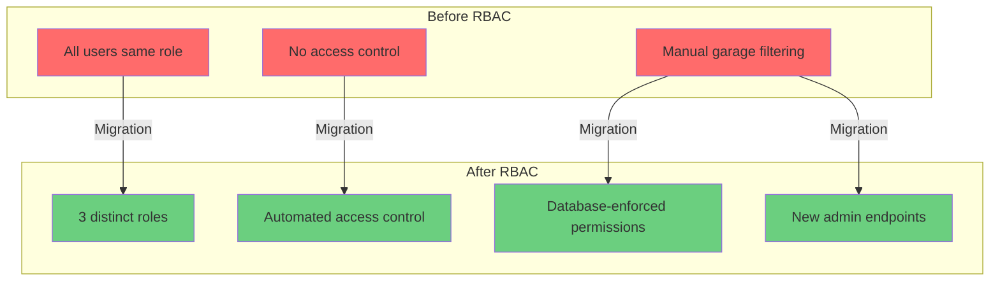

# RBAC Architecture Visualization

## System Overview



## Access Control Flow



## Permission Matrix

| Endpoint | User | Garage Admin | Super Admin |
|----------|------|--------------|-------------|
| `GET /api/users` | ❌ | ❌ | ✅ |
| `GET /api/users/:id` (own) | ✅ | ✅ | ✅ |
| `GET /api/users/:id` (any) | ❌ | ❌ | ✅ |
| `GET /api/passes` | ✅ | ✅ | ✅ |
| `POST /api/billing/subscribe` | ✅ | ✅ | ✅ |
| `GET /api/admin/my-garages` | ❌ | ✅ | ✅ |
| `GET /api/admin/garages/:id/dashboard` | ❌ | ✅* | ✅ |
| `GET /api/admin/garages/:id/reports/pl` | ❌ | ✅* | ✅ |
| `POST /api/admin/garage-admins` | ❌ | ❌ | ✅ |

\* Only for garages they manage

## Database Schema



## Role Hierarchy



## Multi-Garage Admin Example



## API Authorization Logic

```typescript
// 1. Authenticate user
const user = await getCurrentUser(context);
if (!user) {
  return unauthorizedResponse(); // 401
}

// 2. Check role requirement
if (!hasRole(user.role, ['garage_admin', 'super_admin'])) {
  return forbiddenResponse(); // 403
}

// 3. Check garage access (for garage-specific endpoints)
const canManage = await isGarageAdmin(user.id, garageId);
if (!canManage) {
  return forbiddenResponse('No access to this garage'); // 403
}

// 4. Execute request
const data = await getGarageDashboard(garageId);
return successResponse(data); // 200
```

## Middleware Stack



## Real-World Usage Scenario



## Benefits Summary



## Migration Impact



