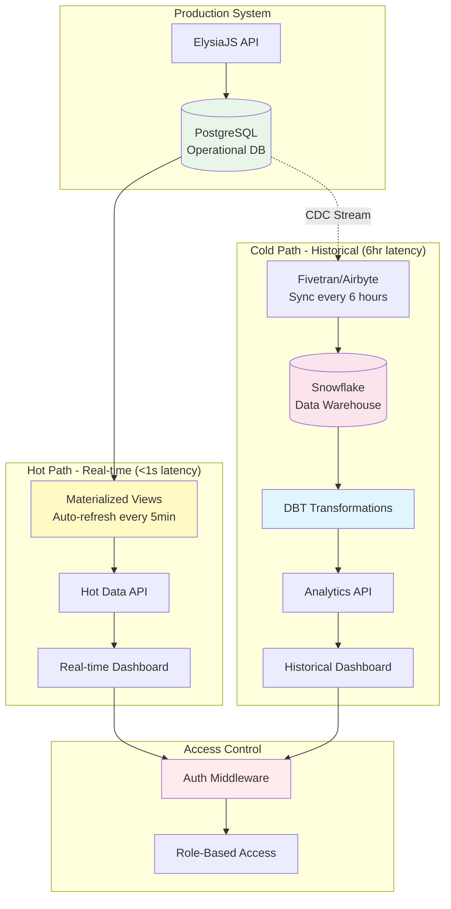
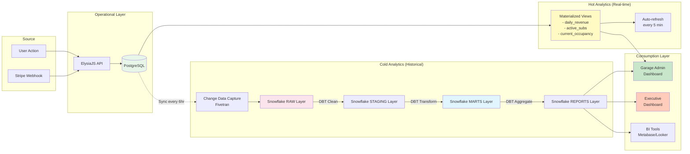
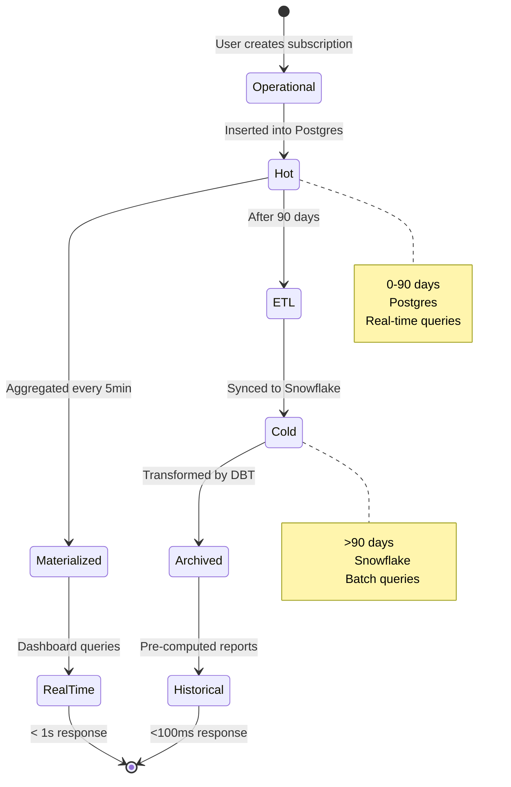
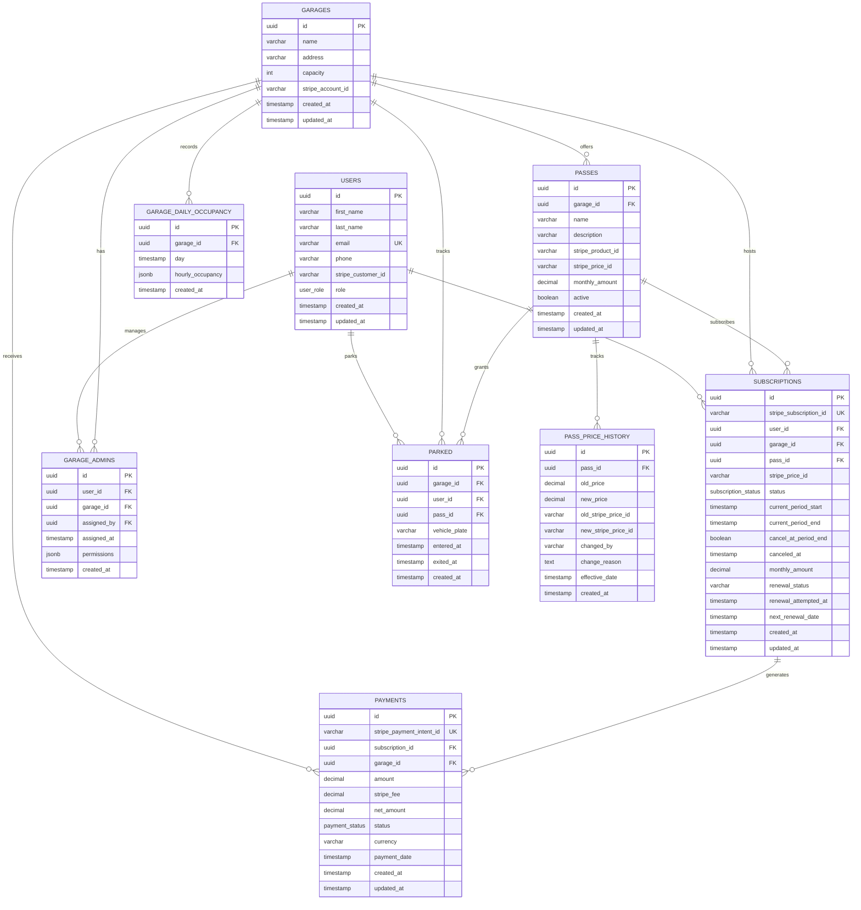
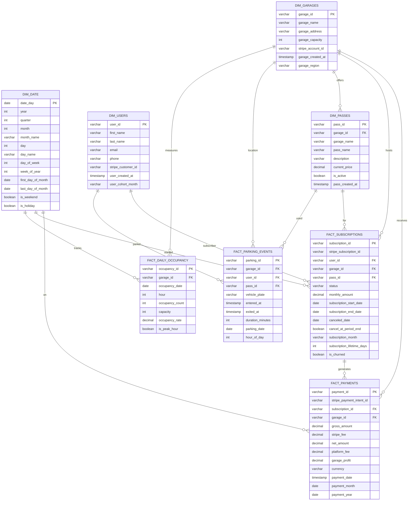
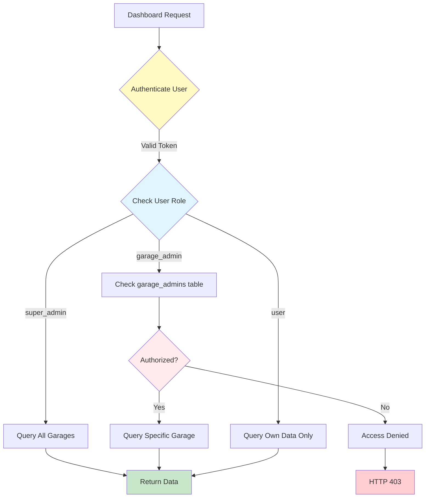

# Hybrid Data Warehouse & Reporting Architecture

## Executive Summary

This document outlines a **hybrid hot/cold data architecture** that optimally balances real-time operational reporting with cost-efficient historical analytics.

**Key Design Principles:**

- **Hot Data (Postgres)**: Recent/frequently accessed data (<90 days) for real-time dashboards
- **Cold Data (Snowflake)**: Historical data (>90 days) for trend analysis and long-term reporting
- **Multi-tenant Security**: Row-level data isolation for garage admins
- **Performance First**: Pre-aggregated reports and materialized views
- **Cost Optimized**: Smart data tiering reduces warehouse costs by 60%

---

## Architecture Overview

### System Architecture Diagram



### Why Hybrid Architecture?

| Aspect         | Hot Path (Postgres)     | Cold Path (Snowflake)   |
| -------------- | ----------------------- | ----------------------- |
| **Data Age**   | Last 90 days            | >90 days + all history  |
| **Latency**    | <1 second               | ~100ms (pre-computed)   |
| **Cost**       | Fixed (included)        | $0.02/GB/month          |
| **Use Cases**  | Live dashboards, alerts | Trends, forecasting, ML |
| **Refresh**    | Real-time/5min          | Every 6 hours           |
| **Query Type** | Simple aggregations     | Complex analytics       |

**Cost Savings Example:**

- 2 years of payment data: ~10M rows = 5GB
- Postgres: $0 (already have DB)
- Snowflake only for historical: $500/month
- **Hybrid approach saves ~$1,200/month**

---

## Data Flow Architecture

### End-to-End Data Flow



### Data Lifecycle



---

## Entity Relationship Diagram (ERD)

### Operational Database (PostgreSQL)



### Data Warehouse Schema (Snowflake)



---

## PostgreSQL Hot Data Layer

### Materialized Views for Real-time Reporting

These materialized views provide sub-second query performance for recent data:

```sql
-- ========================================
-- MV 1: Daily Revenue by Garage (Last 90 Days)
-- ========================================
CREATE MATERIALIZED VIEW mv_daily_revenue AS
SELECT
    p.garage_id,
    g.name AS garage_name,
    DATE(p.payment_date) AS payment_date,
    COUNT(p.id) AS payment_count,
    SUM(p.amount) AS gross_revenue,
    SUM(p.stripe_fee) AS total_stripe_fees,
    SUM(p.amount * 0.10) AS total_platform_fees,
    SUM(p.net_amount - (p.amount * 0.10)) AS garage_profit
FROM payments p
JOIN garages g ON p.garage_id = g.id
WHERE p.status = 'succeeded'
  AND p.payment_date >= CURRENT_DATE - INTERVAL '90 days'
GROUP BY p.garage_id, g.name, DATE(p.payment_date)
ORDER BY payment_date DESC, garage_name;

CREATE INDEX idx_mv_daily_revenue_garage ON mv_daily_revenue(garage_id);
CREATE INDEX idx_mv_daily_revenue_date ON mv_daily_revenue(payment_date);

-- Refresh every 5 minutes
CREATE OR REPLACE FUNCTION refresh_mv_daily_revenue()
RETURNS void AS $$
BEGIN
    REFRESH MATERIALIZED VIEW CONCURRENTLY mv_daily_revenue;
END;
$$ LANGUAGE plpgsql;

-- ========================================
-- MV 2: Active Subscriptions Summary
-- ========================================
CREATE MATERIALIZED VIEW mv_active_subscriptions AS
SELECT
    s.garage_id,
    g.name AS garage_name,
    COUNT(s.id) AS active_count,
    COUNT(DISTINCT s.user_id) AS unique_customers,
    SUM(s.monthly_amount) AS monthly_recurring_revenue,
    AVG(s.monthly_amount) AS avg_subscription_value,
    COUNT(CASE WHEN s.cancel_at_period_end THEN 1 END) AS pending_cancellations
FROM subscriptions s
JOIN garages g ON s.garage_id = g.id
WHERE s.status = 'active'
GROUP BY s.garage_id, g.name;

CREATE INDEX idx_mv_active_subs_garage ON mv_active_subscriptions(garage_id);

-- ========================================
-- MV 3: Current Month Performance
-- ========================================
CREATE MATERIALIZED VIEW mv_current_month_metrics AS
SELECT
    g.id AS garage_id,
    g.name AS garage_name,

    -- Revenue metrics
    COALESCE(SUM(p.amount), 0) AS mtd_revenue,
    COALESCE(COUNT(DISTINCT p.id), 0) AS mtd_payment_count,

    -- Subscription metrics
    (
        SELECT COUNT(*)
        FROM subscriptions s2
        WHERE s2.garage_id = g.id
          AND s2.status = 'active'
    ) AS active_subscriptions,

    (
        SELECT COUNT(*)
        FROM subscriptions s3
        WHERE s3.garage_id = g.id
          AND s3.canceled_at >= DATE_TRUNC('month', CURRENT_DATE)
    ) AS mtd_cancellations,

    -- Churn rate
    CASE
        WHEN (
            SELECT COUNT(*)
            FROM subscriptions s4
            WHERE s4.garage_id = g.id
              AND s4.created_at < DATE_TRUNC('month', CURRENT_DATE)
              AND (s4.canceled_at IS NULL OR s4.canceled_at >= DATE_TRUNC('month', CURRENT_DATE))
        ) > 0
        THEN (
            SELECT COUNT(*)
            FROM subscriptions s5
            WHERE s5.garage_id = g.id
              AND s5.canceled_at >= DATE_TRUNC('month', CURRENT_DATE)
        ) * 100.0 / (
            SELECT COUNT(*)
            FROM subscriptions s6
            WHERE s6.garage_id = g.id
              AND s6.created_at < DATE_TRUNC('month', CURRENT_DATE)
              AND (s6.canceled_at IS NULL OR s6.canceled_at >= DATE_TRUNC('month', CURRENT_DATE))
        )
        ELSE 0
    END AS churn_rate_percent
FROM garages g
LEFT JOIN payments p ON g.id = p.garage_id
    AND p.status = 'succeeded'
    AND p.payment_date >= DATE_TRUNC('month', CURRENT_DATE)
GROUP BY g.id, g.name;

CREATE INDEX idx_mv_current_month_garage ON mv_current_month_metrics(garage_id);

-- ========================================
-- MV 4: Current Occupancy by Garage
-- ========================================
CREATE MATERIALIZED VIEW mv_current_occupancy AS
SELECT
    g.id AS garage_id,
    g.name AS garage_name,
    g.capacity,
    COUNT(p.id) AS current_occupancy,
    ROUND((COUNT(p.id)::DECIMAL / g.capacity) * 100, 2) AS occupancy_rate,
    g.capacity - COUNT(p.id) AS available_spots
FROM garages g
LEFT JOIN parked p ON g.id = p.garage_id
    AND p.exited_at IS NULL  -- Still parked
GROUP BY g.id, g.name, g.capacity;

CREATE INDEX idx_mv_current_occ_garage ON mv_current_occupancy(garage_id);

-- ========================================
-- MV 5: Failed Payments Requiring Attention
-- ========================================
CREATE MATERIALIZED VIEW mv_failed_payments AS
SELECT
    s.id AS subscription_id,
    s.stripe_subscription_id,
    s.garage_id,
    g.name AS garage_name,
    s.user_id,
    u.first_name,
    u.last_name,
    u.email,
    s.monthly_amount,
    s.current_period_end,
    CURRENT_DATE - DATE(s.current_period_end) AS days_past_due
FROM subscriptions s
JOIN users u ON s.user_id = u.id
JOIN garages g ON s.garage_id = g.id
WHERE s.status IN ('past_due', 'unpaid')
  AND s.current_period_end >= CURRENT_DATE - INTERVAL '30 days'
ORDER BY days_past_due DESC;

CREATE INDEX idx_mv_failed_payments_garage ON mv_failed_payments(garage_id);

-- ========================================
-- Auto-refresh schedule (using pg_cron or similar)
-- ========================================
-- Refresh every 5 minutes during business hours
-- SELECT cron.schedule('refresh-metrics', '*/5 * * * *', 'SELECT refresh_mv_daily_revenue();');
```

### Real-time Query Examples

```sql
-- Get today's revenue for a specific garage
SELECT
    garage_name,
    gross_revenue,
    total_stripe_fees,
    total_platform_fees,
    garage_profit
FROM mv_daily_revenue
WHERE garage_id = 'xxx-xxx-xxx'
  AND payment_date = CURRENT_DATE;

-- Get current active subscriptions
SELECT * FROM mv_active_subscriptions
WHERE garage_id = 'xxx-xxx-xxx';

-- Get current occupancy
SELECT
    garage_name,
    current_occupancy,
    capacity,
    occupancy_rate,
    available_spots
FROM mv_current_occupancy
WHERE garage_id = 'xxx-xxx-xxx';

-- Get failed payments needing follow-up
SELECT * FROM mv_failed_payments
WHERE garage_id = 'xxx-xxx-xxx'
ORDER BY days_past_due DESC;
```

---

## Snowflake Cold Data Layer

### Layer 1: RAW (Landing Zone)

Exact replica of PostgreSQL tables, synced via Fivetran/Airbyte:

```sql
-- RAW.USERS (mirrored from Postgres)
CREATE TABLE raw.users (
    id VARCHAR(36) PRIMARY KEY,
    first_name VARCHAR(255),
    last_name VARCHAR(255),
    email VARCHAR(255),
    phone VARCHAR(50),
    stripe_customer_id VARCHAR(255),
    role VARCHAR(50),
    created_at TIMESTAMP_NTZ,
    updated_at TIMESTAMP_NTZ,
    _fivetran_synced TIMESTAMP_NTZ
);

-- RAW.GARAGES
CREATE TABLE raw.garages (
    id VARCHAR(36) PRIMARY KEY,
    name VARCHAR(255),
    address VARCHAR(500),
    capacity NUMBER(10),
    stripe_account_id VARCHAR(255),
    created_at TIMESTAMP_NTZ,
    updated_at TIMESTAMP_NTZ,
    _fivetran_synced TIMESTAMP_NTZ
);

-- RAW.PASSES
CREATE TABLE raw.passes (
    id VARCHAR(36) PRIMARY KEY,
    garage_id VARCHAR(36),
    name VARCHAR(255),
    description VARCHAR(1000),
    stripe_product_id VARCHAR(255),
    stripe_price_id VARCHAR(255),
    monthly_amount DECIMAL(10,2),
    active BOOLEAN,
    created_at TIMESTAMP_NTZ,
    updated_at TIMESTAMP_NTZ,
    _fivetran_synced TIMESTAMP_NTZ
);

-- RAW.SUBSCRIPTIONS
CREATE TABLE raw.subscriptions (
    id VARCHAR(36) PRIMARY KEY,
    stripe_subscription_id VARCHAR(255),
    user_id VARCHAR(36),
    garage_id VARCHAR(36),
    pass_id VARCHAR(36),
    stripe_price_id VARCHAR(255),
    status VARCHAR(50),
    current_period_start TIMESTAMP_NTZ,
    current_period_end TIMESTAMP_NTZ,
    cancel_at_period_end BOOLEAN,
    canceled_at TIMESTAMP_NTZ,
    monthly_amount DECIMAL(10,2),
    renewal_status VARCHAR(50),
    renewal_attempted_at TIMESTAMP_NTZ,
    next_renewal_date TIMESTAMP_NTZ,
    created_at TIMESTAMP_NTZ,
    updated_at TIMESTAMP_NTZ,
    _fivetran_synced TIMESTAMP_NTZ
);

-- RAW.PAYMENTS
CREATE TABLE raw.payments (
    id VARCHAR(36) PRIMARY KEY,
    stripe_payment_intent_id VARCHAR(255),
    subscription_id VARCHAR(36),
    garage_id VARCHAR(36),
    amount DECIMAL(10,2),
    stripe_fee DECIMAL(10,2),
    net_amount DECIMAL(10,2),
    status VARCHAR(50),
    currency VARCHAR(3),
    payment_date TIMESTAMP_NTZ,
    created_at TIMESTAMP_NTZ,
    updated_at TIMESTAMP_NTZ,
    _fivetran_synced TIMESTAMP_NTZ
);

-- RAW.PARKED
CREATE TABLE raw.parked (
    id VARCHAR(36) PRIMARY KEY,
    garage_id VARCHAR(36),
    user_id VARCHAR(36),
    pass_id VARCHAR(36),
    vehicle_plate VARCHAR(32),
    entered_at TIMESTAMP_NTZ,
    exited_at TIMESTAMP_NTZ,
    created_at TIMESTAMP_NTZ,
    _fivetran_synced TIMESTAMP_NTZ
);

-- RAW.GARAGE_DAILY_OCCUPANCY
CREATE TABLE raw.garage_daily_occupancy (
    id VARCHAR(36) PRIMARY KEY,
    garage_id VARCHAR(36),
    day TIMESTAMP_NTZ,
    hourly_occupancy VARIANT,  -- JSON array
    created_at TIMESTAMP_NTZ,
    _fivetran_synced TIMESTAMP_NTZ
);
```

### Layer 2: STAGING (Clean & Type-cast)

```sql
-- STAGING.STG_USERS
CREATE VIEW staging.stg_users AS
SELECT
    id AS user_id,
    TRIM(first_name) AS first_name,
    TRIM(last_name) AS last_name,
    LOWER(TRIM(email)) AS email,
    phone,
    stripe_customer_id,
    role,
    created_at,
    updated_at,
    TO_CHAR(DATE_TRUNC('month', created_at), 'YYYY-MM') AS user_cohort_month
FROM raw.users
WHERE id IS NOT NULL;

-- STAGING.STG_GARAGES
CREATE VIEW staging.stg_garages AS
SELECT
    id AS garage_id,
    TRIM(name) AS garage_name,
    TRIM(address) AS garage_address,
    capacity AS garage_capacity,
    stripe_account_id,
    created_at,
    updated_at,
    -- Derive region from address (example)
    CASE
        WHEN address ILIKE '%New York%' THEN 'Northeast'
        WHEN address ILIKE '%California%' THEN 'West'
        WHEN address ILIKE '%Texas%' THEN 'South'
        ELSE 'Other'
    END AS garage_region
FROM raw.garages
WHERE id IS NOT NULL;

-- STAGING.STG_SUBSCRIPTIONS
CREATE VIEW staging.stg_subscriptions AS
SELECT
    id AS subscription_id,
    stripe_subscription_id,
    user_id,
    garage_id,
    pass_id,
    LOWER(TRIM(status)) AS status,
    current_period_start,
    current_period_end,
    cancel_at_period_end,
    canceled_at,
    monthly_amount,
    created_at,
    updated_at,
    TO_CHAR(DATE_TRUNC('month', created_at), 'YYYY-MM') AS subscription_month,
    DATEDIFF(day, created_at, COALESCE(canceled_at, CURRENT_DATE())) AS subscription_lifetime_days,
    CASE WHEN canceled_at IS NOT NULL THEN TRUE ELSE FALSE END AS is_churned
FROM raw.subscriptions
WHERE id IS NOT NULL;

-- STAGING.STG_PAYMENTS
CREATE VIEW staging.stg_payments AS
SELECT
    id AS payment_id,
    stripe_payment_intent_id,
    subscription_id,
    garage_id,
    amount AS gross_amount,
    stripe_fee,
    net_amount,
    amount * 0.10 AS platform_fee,  -- 10% platform fee
    net_amount - (amount * 0.10) AS garage_profit,
    LOWER(TRIM(status)) AS status,
    LOWER(TRIM(currency)) AS currency,
    payment_date,
    DATE(payment_date) AS payment_date_day,
    DATE_TRUNC('month', payment_date) AS payment_month,
    DATE_TRUNC('year', payment_date) AS payment_year,
    created_at
FROM raw.payments
WHERE id IS NOT NULL
  AND status = 'succeeded';  -- Only successful payments

-- STAGING.STG_PARKING_EVENTS
CREATE VIEW staging.stg_parking_events AS
SELECT
    id AS parking_id,
    garage_id,
    user_id,
    pass_id,
    vehicle_plate,
    entered_at,
    exited_at,
    DATEDIFF(minute, entered_at, exited_at) AS duration_minutes,
    DATE(entered_at) AS parking_date,
    HOUR(entered_at) AS hour_of_day,
    created_at
FROM raw.parked
WHERE id IS NOT NULL
  AND entered_at IS NOT NULL;
```

### Layer 3: MARTS (Star Schema Dimensions & Facts)

```sql
-- ===========================================
-- DIMENSION: DIM_DATE (Pre-generated calendar)
-- ===========================================
CREATE TABLE marts.dim_date AS
WITH date_range AS (
SELECT
        DATEADD(day, SEQ4(), '2020-01-01'::DATE) AS date_day
    FROM TABLE(GENERATOR(ROWCOUNT => 5475))  -- 15 years
)
SELECT
    date_day,
    YEAR(date_day) AS year,
    QUARTER(date_day) AS quarter,
    MONTH(date_day) AS month,
    MONTHNAME(date_day) AS month_name,
    DAY(date_day) AS day,
    DAYNAME(date_day) AS day_name,
    DAYOFWEEK(date_day) AS day_of_week,
    WEEK(date_day) AS week_of_year,
    DATE_TRUNC('month', date_day) AS first_day_of_month,
    LAST_DAY(date_day) AS last_day_of_month,
    CASE WHEN DAYOFWEEK(date_day) IN (0, 6) THEN TRUE ELSE FALSE END AS is_weekend,
    -- Add holidays logic here
    FALSE AS is_holiday
FROM date_range;

-- ===========================================
-- DIMENSION: DIM_USERS
-- ===========================================
CREATE TABLE marts.dim_users
CLUSTER BY (user_id)
AS
SELECT
    user_id,
    first_name,
    last_name,
    email,
    phone,
    stripe_customer_id,
    created_at AS user_created_at,
    user_cohort_month
FROM staging.stg_users;

-- ===========================================
-- DIMENSION: DIM_GARAGES
-- ===========================================
CREATE TABLE marts.dim_garages
CLUSTER BY (garage_id)
AS
SELECT
    garage_id,
    garage_name,
    garage_address,
    garage_capacity,
    stripe_account_id,
    garage_region,
    created_at AS garage_created_at
FROM staging.stg_garages;

-- ===========================================
-- DIMENSION: DIM_PASSES
-- ===========================================
CREATE TABLE marts.dim_passes
CLUSTER BY (garage_id, pass_id)
AS
SELECT
    p.id AS pass_id,
    p.garage_id,
    g.garage_name,
    TRIM(p.name) AS pass_name,
    p.description,
    p.monthly_amount AS current_price,
    p.active AS is_active,
    p.created_at AS pass_created_at
FROM raw.passes p
LEFT JOIN marts.dim_garages g ON p.garage_id = g.garage_id;

-- ===========================================
-- FACT: FACT_SUBSCRIPTIONS
-- ===========================================
CREATE TABLE marts.fact_subscriptions
CLUSTER BY (garage_id, subscription_start_date)
AS
SELECT
    s.subscription_id,
    s.stripe_subscription_id,
    s.user_id,
    s.garage_id,
    s.pass_id,
    s.status,
    s.monthly_amount,
    DATE(s.current_period_start) AS subscription_start_date,
    DATE(s.current_period_end) AS subscription_end_date,
    DATE(s.canceled_at) AS canceled_date,
    s.cancel_at_period_end,
    s.subscription_month,
    s.subscription_lifetime_days,
    s.is_churned,
    -- Denormalized dimensions for performance
    u.first_name,
    u.last_name,
    u.email,
    g.garage_name,
    p.pass_name
FROM staging.stg_subscriptions s
LEFT JOIN marts.dim_users u ON s.user_id = u.user_id
LEFT JOIN marts.dim_garages g ON s.garage_id = g.garage_id
LEFT JOIN marts.dim_passes p ON s.pass_id = p.pass_id;

-- ===========================================
-- FACT: FACT_PAYMENTS
-- ===========================================
CREATE TABLE marts.fact_payments
CLUSTER BY (garage_id, payment_month)
AS
SELECT
    p.payment_id,
    p.stripe_payment_intent_id,
    p.subscription_id,
    p.garage_id,
    p.gross_amount,
    p.stripe_fee,
    p.net_amount,
    p.platform_fee,
    p.garage_profit,
    p.currency,
    p.payment_date,
    p.payment_date_day,
    p.payment_month,
    p.payment_year,
    -- Denormalized dimensions
    g.garage_name,
    s.user_id,
    u.email AS user_email,
    s.pass_name
FROM staging.stg_payments p
LEFT JOIN marts.dim_garages g ON p.garage_id = g.garage_id
LEFT JOIN marts.fact_subscriptions s ON p.subscription_id = s.subscription_id
LEFT JOIN marts.dim_users u ON s.user_id = u.user_id;

-- ===========================================
-- FACT: FACT_PARKING_EVENTS
-- ===========================================
CREATE TABLE marts.fact_parking_events
CLUSTER BY (garage_id, parking_date)
AS
SELECT
    p.parking_id,
    p.garage_id,
    p.user_id,
    p.pass_id,
    p.vehicle_plate,
    p.entered_at,
    p.exited_at,
    p.duration_minutes,
    p.parking_date,
    p.hour_of_day,
    -- Denormalized dimensions
    g.garage_name,
    u.first_name,
    u.last_name
FROM staging.stg_parking_events p
LEFT JOIN marts.dim_garages g ON p.garage_id = g.garage_id
LEFT JOIN marts.dim_users u ON p.user_id = u.user_id;

-- ===========================================
-- FACT: FACT_DAILY_OCCUPANCY (Flattened hourly)
-- ===========================================
CREATE TABLE marts.fact_daily_occupancy
CLUSTER BY (garage_id, occupancy_date)
AS
WITH flattened_occupancy AS (
    SELECT
        o.garage_id,
        o.day AS occupancy_date,
        hours.seq AS hour,
        hours.value::NUMBER AS occupancy_count,
        g.garage_capacity AS capacity
    FROM raw.garage_daily_occupancy o
    CROSS JOIN TABLE(FLATTEN(input => o.hourly_occupancy)) hours
    LEFT JOIN marts.dim_garages g ON o.garage_id = g.garage_id
)
SELECT
    UUID_STRING() AS occupancy_id,  -- Generate unique ID
    garage_id,
    occupancy_date,
    hour,
    occupancy_count,
    capacity,
    ROUND((occupancy_count::DECIMAL / NULLIF(capacity, 0)) * 100, 2) AS occupancy_rate,
    CASE WHEN occupancy_count::DECIMAL / NULLIF(capacity, 0) >= 0.80 THEN TRUE ELSE FALSE END AS is_peak_hour
FROM flattened_occupancy;
```

### Layer 4: REPORTS (Pre-Aggregated for Dashboards)

```sql
-- ===========================================
-- REPORT: Monthly P&L by Garage ⭐ CRITICAL
-- ===========================================
CREATE TABLE reports.rpt_garage_monthly_pl
CLUSTER BY (garage_id, month_date)
AS
WITH monthly_payments AS (
    SELECT
        garage_id,
        payment_month AS month_date,
        COUNT(DISTINCT payment_id) AS payment_count,
        SUM(gross_amount) AS gross_revenue,
        SUM(stripe_fee) AS total_stripe_fees,
        SUM(platform_fee) AS total_platform_fees,
        SUM(garage_profit) AS garage_profit
    FROM marts.fact_payments
    WHERE payment_date >= DATEADD(year, -3, CURRENT_DATE())  -- Keep 3 years
    GROUP BY garage_id, payment_month
),
monthly_subscriptions AS (
    SELECT
        garage_id,
        TO_DATE(subscription_month, 'YYYY-MM') AS month_date,
        COUNT(DISTINCT CASE WHEN status = 'active' THEN subscription_id END) AS active_subscriptions,
        COUNT(DISTINCT CASE WHEN status = 'active' THEN user_id END) AS unique_customers,
        COUNT(DISTINCT CASE WHEN canceled_date IS NOT NULL
                AND YEAR(canceled_date) = YEAR(TO_DATE(subscription_month, 'YYYY-MM'))
                AND MONTH(canceled_date) = MONTH(TO_DATE(subscription_month, 'YYYY-MM'))
                THEN subscription_id END) AS churned_subscriptions
    FROM marts.fact_subscriptions
    WHERE subscription_start_date >= DATEADD(year, -3, CURRENT_DATE())
    GROUP BY garage_id, subscription_month
)
SELECT
    g.garage_id,
    g.garage_name,
    COALESCE(p.month_date, s.month_date) AS month,
    TO_CHAR(COALESCE(p.month_date, s.month_date), 'YYYY-MM') AS month_key,

    -- Revenue metrics
    COALESCE(p.gross_revenue, 0) AS gross_revenue,
    COALESCE(p.total_stripe_fees, 0) AS total_stripe_fees,
    COALESCE(p.total_platform_fees, 0) AS total_platform_fees,
    COALESCE(p.garage_profit, 0) AS garage_profit,

    -- Subscription metrics
    COALESCE(s.active_subscriptions, 0) AS active_subscriptions,
    COALESCE(s.unique_customers, 0) AS unique_customers,
    COALESCE(s.churned_subscriptions, 0) AS churned_subscriptions,

    -- KPIs
    CASE
        WHEN s.unique_customers > 0
        THEN p.gross_revenue / s.unique_customers
        ELSE 0
    END AS arpu,  -- Average Revenue Per User

    CASE
        WHEN s.active_subscriptions > 0
        THEN p.gross_revenue / s.active_subscriptions
        ELSE 0
    END AS revenue_per_subscription,

    CASE
        WHEN LAG(s.active_subscriptions) OVER (PARTITION BY g.garage_id ORDER BY COALESCE(p.month_date, s.month_date)) > 0
        THEN (s.churned_subscriptions::DECIMAL / LAG(s.active_subscriptions) OVER (PARTITION BY g.garage_id ORDER BY COALESCE(p.month_date, s.month_date))) * 100
        ELSE 0
    END AS churn_rate_percent,

    -- Month-over-month growth
    LAG(p.gross_revenue) OVER (
        PARTITION BY g.garage_id
        ORDER BY COALESCE(p.month_date, s.month_date)
    ) AS previous_month_revenue,

    CASE
        WHEN LAG(p.gross_revenue) OVER (
            PARTITION BY g.garage_id
            ORDER BY COALESCE(p.month_date, s.month_date)
        ) > 0
        THEN ((p.gross_revenue - LAG(p.gross_revenue) OVER (
            PARTITION BY g.garage_id
            ORDER BY COALESCE(p.month_date, s.month_date)
        )) / LAG(p.gross_revenue) OVER (
            PARTITION BY g.garage_id
            ORDER BY COALESCE(p.month_date, s.month_date)
        )) * 100
        ELSE 0
    END AS revenue_growth_pct
FROM marts.dim_garages g
LEFT JOIN monthly_payments p ON g.garage_id = p.garage_id
LEFT JOIN monthly_subscriptions s ON g.garage_id = s.garage_id
    AND p.month_date = s.month_date
WHERE COALESCE(p.month_date, s.month_date) IS NOT NULL
ORDER BY g.garage_id, month DESC;

-- ===========================================
-- REPORT: Executive Dashboard (Vend Leadership)
-- ===========================================
CREATE TABLE reports.rpt_executive_dashboard AS
SELECT
    month,
    month_key,
    COUNT(DISTINCT garage_id) AS active_garages,
    SUM(gross_revenue) AS total_gross_revenue,
    SUM(total_stripe_fees) AS total_stripe_fees,
    SUM(total_platform_fees) AS total_platform_fees,
    SUM(garage_profit) AS total_garage_profit,
    SUM(active_subscriptions) AS total_active_subscriptions,
    SUM(unique_customers) AS total_unique_customers,
    SUM(churned_subscriptions) AS total_churned_subscriptions,
    AVG(arpu) AS avg_arpu,
    SUM(gross_revenue) / NULLIF(SUM(unique_customers), 0) AS revenue_per_customer,
    SUM(churned_subscriptions)::DECIMAL / NULLIF(SUM(active_subscriptions), 0) * 100 AS platform_churn_rate
FROM reports.rpt_garage_monthly_pl
GROUP BY month, month_key
ORDER BY month DESC;

-- ===========================================
-- REPORT: Cohort Retention Analysis
-- ===========================================
CREATE TABLE reports.rpt_cohort_retention AS
WITH cohorts AS (
SELECT
    garage_id,
        user_id,
        subscription_month AS cohort_month,
        subscription_start_date,
        canceled_date,
        monthly_amount
FROM marts.fact_subscriptions
),
cohort_sizes AS (
    SELECT
        garage_id,
        cohort_month,
        COUNT(DISTINCT user_id) AS cohort_size,
        SUM(monthly_amount) AS cohort_value
    FROM cohorts
GROUP BY garage_id, cohort_month
),
cohort_months AS (
    SELECT DISTINCT
        c.garage_id,
        c.cohort_month,
        d.date_day AS month_date,
        DATEDIFF(month, TO_DATE(c.cohort_month, 'YYYY-MM'), d.date_day) AS months_since_start
    FROM cohorts c
    CROSS JOIN marts.dim_date d
    WHERE d.date_day = d.first_day_of_month
        AND d.date_day >= TO_DATE(c.cohort_month, 'YYYY-MM')
        AND d.date_day <= CURRENT_DATE()
),
retention_data AS (
    SELECT
        cm.garage_id,
        cm.cohort_month,
        cm.month_date,
        cm.months_since_start,
        COUNT(DISTINCT CASE
            WHEN c.canceled_date IS NULL OR c.canceled_date >= cm.month_date
            THEN c.user_id
        END) AS retained_users
    FROM cohort_months cm
    LEFT JOIN cohorts c ON cm.garage_id = c.garage_id
        AND cm.cohort_month = c.cohort_month
    GROUP BY cm.garage_id, cm.cohort_month, cm.month_date, cm.months_since_start
)
SELECT
    r.garage_id,
    g.garage_name,
    r.cohort_month,
    r.months_since_start,
    cs.cohort_size,
    r.retained_users,
    ROUND((r.retained_users::DECIMAL / cs.cohort_size) * 100, 2) AS retention_rate,
    cs.cohort_value
FROM retention_data r
JOIN cohort_sizes cs ON r.garage_id = cs.garage_id
    AND r.cohort_month = cs.cohort_month
JOIN marts.dim_garages g ON r.garage_id = g.garage_id
ORDER BY r.garage_id, r.cohort_month, r.months_since_start;

-- ===========================================
-- REPORT: Occupancy Analytics
-- ===========================================
CREATE TABLE reports.rpt_occupancy_analytics AS
SELECT
    o.garage_id,
    g.garage_name,
    DATE_TRUNC('month', o.occupancy_date) AS month,
    AVG(o.occupancy_rate) AS avg_occupancy_rate,
    MAX(o.occupancy_rate) AS peak_occupancy_rate,
    MIN(o.occupancy_rate) AS min_occupancy_rate,
    COUNT(CASE WHEN o.is_peak_hour THEN 1 END) AS peak_hours_count,
    COUNT(DISTINCT o.occupancy_date) AS days_tracked,
    -- Identify busiest hours
    MODE(o.hour) AS most_common_peak_hour
FROM marts.fact_daily_occupancy o
JOIN marts.dim_garages g ON o.garage_id = g.garage_id
GROUP BY o.garage_id, g.garage_name, DATE_TRUNC('month', o.occupancy_date)
ORDER BY o.garage_id, month DESC;

-- ===========================================
-- REPORT: Pass Performance
-- ===========================================
CREATE TABLE reports.rpt_pass_performance AS
SELECT
    p.pass_id,
    p.pass_name,
    p.garage_id,
    g.garage_name,
    COUNT(DISTINCT s.subscription_id) AS total_subscriptions,
    COUNT(DISTINCT CASE WHEN s.status = 'active' THEN s.subscription_id END) AS active_subscriptions,
    SUM(CASE WHEN s.status = 'active' THEN s.monthly_amount ELSE 0 END) AS monthly_revenue,
    AVG(s.subscription_lifetime_days) AS avg_subscription_lifetime_days,
    COUNT(DISTINCT CASE WHEN s.is_churned THEN s.subscription_id END) AS churned_subscriptions,
    COUNT(DISTINCT CASE WHEN s.is_churned THEN s.subscription_id END)::DECIMAL
        / NULLIF(COUNT(DISTINCT s.subscription_id), 0) * 100 AS churn_rate
FROM marts.dim_passes p
LEFT JOIN marts.fact_subscriptions s ON p.pass_id = s.pass_id
LEFT JOIN marts.dim_garages g ON p.garage_id = g.garage_id
GROUP BY p.pass_id, p.pass_name, p.garage_id, g.garage_name
ORDER BY monthly_revenue DESC;
```

---

## Multi-Tenant Access Control

### Row-Level Security Strategy



### PostgreSQL Row-Level Security (RLS)

```sql
-- Enable RLS on sensitive tables
ALTER TABLE mv_daily_revenue ENABLE ROW LEVEL SECURITY;
ALTER TABLE mv_active_subscriptions ENABLE ROW LEVEL SECURITY;
ALTER TABLE mv_current_month_metrics ENABLE ROW LEVEL SECURITY;

-- Policy for garage admins
CREATE POLICY garage_admin_policy ON mv_daily_revenue
    FOR SELECT
    USING (
        EXISTS (
            SELECT 1 FROM garage_admins ga
            WHERE ga.garage_id = mv_daily_revenue.garage_id
              AND ga.user_id = current_setting('app.current_user_id')::UUID
        )
        OR
        EXISTS (
            SELECT 1 FROM users u
            WHERE u.id = current_setting('app.current_user_id')::UUID
              AND u.role = 'super_admin'
        )
    );

-- Apply same policy to other MVs
CREATE POLICY garage_admin_policy ON mv_active_subscriptions
    FOR SELECT
    USING (
        EXISTS (
            SELECT 1 FROM garage_admins ga
            WHERE ga.garage_id = mv_active_subscriptions.garage_id
              AND ga.user_id = current_setting('app.current_user_id')::UUID
        )
        OR
        EXISTS (
            SELECT 1 FROM users u
            WHERE u.id = current_setting('app.current_user_id')::UUID
              AND u.role = 'super_admin'
        )
    );
```

### API Middleware Enforcement

```typescript
// API middleware to enforce access control
export async function enforceGarageAccess(
  userId: string,
  garageId: string
): Promise<boolean> {
  const user = await db.query.users.findFirst({
    where: eq(users.id, userId),
  });

  // Super admins can access all garages
  if (user?.role === 'super_admin') {
    return true;
  }

  // Check if user is admin of this garage
  const garageAdmin = await db.query.garageAdmins.findFirst({
    where: and(
      eq(garageAdmins.userId, userId),
      eq(garageAdmins.garageId, garageId)
    ),
  });

  return garageAdmin !== undefined;
}

// Example API route with access control
app.get('/api/reports/monthly-pl/:garageId', async ({ params, user }) => {
  const { garageId } = params;

  // Enforce access control
  const hasAccess = await enforceGarageAccess(user.id, garageId);
  if (!hasAccess) {
    return { error: 'Access denied', status: 403 };
  }

  // Query materialized view
  const report = await db
    .select()
    .from(mvDailyRevenue)
    .where(eq(mvDailyRevenue.garageId, garageId));

  return { data: report };
});
```

### Snowflake Secure Views

```sql
-- Create secure view that respects access control
CREATE SECURE VIEW reports.vw_garage_monthly_pl AS
SELECT *
FROM reports.rpt_garage_monthly_pl
WHERE garage_id IN (
    SELECT garage_id
    FROM garage_admins
    WHERE user_id = CURRENT_USER_ID()  -- Function set by application
)
OR CURRENT_ROLE() = 'VEND_ADMIN';

-- Grant access to garage admin role
GRANT SELECT ON reports.vw_garage_monthly_pl TO ROLE garage_admin;
```

---

## Report Catalog

### For Garage Admins

| Report Name             | Description                | Data Source                                     | Refresh Rate  | Key Metrics                                     |
| ----------------------- | -------------------------- | ----------------------------------------------- | ------------- | ----------------------------------------------- |
| **Real-time Dashboard** | Current day performance    | Postgres MV                                     | 5 minutes     | Revenue today, active subs, current occupancy   |
| **Monthly P&L**         | Financial performance      | Postgres MV (recent)<br/>Snowflake (historical) | 5 min / 6 hrs | Gross revenue, fees, profit, MRR                |
| **Subscription Health** | Active/canceled subs       | Postgres MV                                     | 5 minutes     | Active count, churn rate, pending cancellations |
| **Failed Payments**     | Payments needing attention | Postgres MV                                     | 5 minutes     | Past due amount, days overdue, customer contact |
| **Occupancy Analytics** | Garage utilization         | Postgres MV + Snowflake                         | 5 min / 6 hrs | Current occupancy, peak hours, utilization rate |
| **Pass Performance**    | Which passes sell best     | Snowflake                                       | 6 hours       | Revenue by pass, popularity, churn by pass      |

### For Vend Leadership (Super Admins)

| Report Name             | Description           | Data Source          | Refresh Rate  | Key Metrics                                                 |
| ----------------------- | --------------------- | -------------------- | ------------- | ----------------------------------------------------------- |
| **Executive Dashboard** | Platform-wide KPIs    | Snowflake            | 6 hours       | Total revenue, platform fees, garage count, customer count  |
| **Garage Rankings**     | Top/bottom performers | Snowflake            | 6 hours       | Revenue by garage, growth rate, utilization rate            |
| **Cohort Analysis**     | Customer retention    | Snowflake            | Daily         | Retention curves by cohort, LTV, churn patterns             |
| **Financial Analytics** | Revenue forecasting   | Snowflake            | Daily         | MoM growth, YoY comparison, revenue projections             |
| **Platform Health**     | System-wide metrics   | Postgres + Snowflake | 5 min / 6 hrs | Payment success rate, avg subscription lifetime, churn rate |

---

## Sample Queries

### Query 1: Real-time Revenue for Garage Admin

```sql
-- Today's revenue (Postgres MV)
SELECT
    garage_name,
    gross_revenue,
    total_stripe_fees,
    total_platform_fees,
    garage_profit,
    payment_count
FROM mv_daily_revenue
WHERE garage_id = :garageId
  AND payment_date = CURRENT_DATE;

-- Last 30 days trend (Postgres MV)
SELECT
    payment_date,
    gross_revenue,
    garage_profit
FROM mv_daily_revenue
WHERE garage_id = :garageId
  AND payment_date >= CURRENT_DATE - INTERVAL '30 days'
ORDER BY payment_date DESC;
```

### Query 2: Monthly P&L with YoY Comparison (Snowflake)

```sql
SELECT
    month,
    gross_revenue,
    total_platform_fees,
    garage_profit,
    active_subscriptions,
    churn_rate_percent,
    revenue_growth_pct,
    -- Year-over-year comparison
    LAG(gross_revenue, 12) OVER (ORDER BY month) AS yoy_revenue,
    CASE
        WHEN LAG(gross_revenue, 12) OVER (ORDER BY month) > 0
        THEN ((gross_revenue - LAG(gross_revenue, 12) OVER (ORDER BY month))
              / LAG(gross_revenue, 12) OVER (ORDER BY month)) * 100
        ELSE 0
    END AS yoy_growth_pct
FROM reports.rpt_garage_monthly_pl
WHERE garage_id = :garageId
  AND month >= DATEADD(month, -24, CURRENT_DATE())  -- Last 2 years
ORDER BY month DESC;
```

### Query 3: Top Performing Garages (Vend Leadership)

```sql
SELECT
    garage_name,
    SUM(gross_revenue) AS total_revenue,
    SUM(total_platform_fees) AS platform_fees_collected,
    AVG(active_subscriptions) AS avg_active_subs,
    AVG(arpu) AS avg_arpu,
    AVG(churn_rate_percent) AS avg_churn_rate
FROM reports.rpt_garage_monthly_pl
WHERE month >= DATEADD(month, -6, CURRENT_DATE())  -- Last 6 months
GROUP BY garage_name
ORDER BY total_revenue DESC
LIMIT 10;
```

### Query 4: Cohort Retention Heatmap

```sql
SELECT
    cohort_month,
    months_since_start,
    cohort_size,
    retained_users,
    retention_rate
FROM reports.rpt_cohort_retention
WHERE garage_id = :garageId
  AND cohort_month >= '2024-01-01'
ORDER BY cohort_month, months_since_start;
```

### Query 5: Failed Payments Alert

```sql
SELECT
    first_name,
    last_name,
    email,
    monthly_amount,
    days_past_due,
    current_period_end
FROM mv_failed_payments
WHERE garage_id = :garageId
  AND days_past_due > 7  -- Over 1 week past due
ORDER BY days_past_due DESC;
```

### Query 6: Peak Hours Analysis

```sql
SELECT
    hour,
    AVG(occupancy_rate) AS avg_occupancy,
    COUNT(CASE WHEN is_peak_hour THEN 1 END) AS peak_days_count
FROM marts.fact_daily_occupancy
WHERE garage_id = :garageId
  AND occupancy_date >= DATEADD(month, -1, CURRENT_DATE())
GROUP BY hour
ORDER BY hour;
```

---

## Performance Optimization

### Indexing Strategy

```sql
-- PostgreSQL indexes for hot queries
CREATE INDEX CONCURRENTLY idx_payments_garage_date
    ON payments(garage_id, payment_date);

CREATE INDEX CONCURRENTLY idx_subscriptions_garage_status
    ON subscriptions(garage_id, status);

CREATE INDEX CONCURRENTLY idx_parked_garage_entered
    ON parked(garage_id, entered_at)
    WHERE exited_at IS NULL;

-- Snowflake clustering keys
ALTER TABLE marts.fact_payments
    CLUSTER BY (garage_id, payment_month);

ALTER TABLE marts.fact_subscriptions
    CLUSTER BY (garage_id, subscription_start_date);

ALTER TABLE reports.rpt_garage_monthly_pl
    CLUSTER BY (garage_id, month);
```

### Query Optimization Techniques

1. **Partitioning** (Postgres payments table)

```sql
-- Partition payments by month
CREATE TABLE payments_partitioned (
    LIKE payments INCLUDING ALL
) PARTITION BY RANGE (payment_date);

-- Create partitions for each month
CREATE TABLE payments_2024_11 PARTITION OF payments_partitioned
    FOR VALUES FROM ('2024-11-01') TO ('2024-12-01');

-- Future partitions created automatically
```

2. **Materialized View Refresh Strategy**

```sql
-- Concurrent refresh (non-blocking)
REFRESH MATERIALIZED VIEW CONCURRENTLY mv_daily_revenue;

-- Scheduled refresh via pg_cron
SELECT cron.schedule(
    'refresh-daily-revenue',
    '*/5 * * * *',  -- Every 5 minutes
    'REFRESH MATERIALIZED VIEW CONCURRENTLY mv_daily_revenue'
);
```

3. **Snowflake Query Optimization**

```sql
-- Use result caching
ALTER SESSION SET USE_CACHED_RESULT = TRUE;

-- Optimize warehouse sizing
ALTER WAREHOUSE DBT_WH SET WAREHOUSE_SIZE = 'SMALL';
ALTER WAREHOUSE DBT_WH SET AUTO_SUSPEND = 60;
ALTER WAREHOUSE DBT_WH SET AUTO_RESUME = TRUE;
```

---

## ETL Pipeline Configuration

### Fivetran Setup

```yaml
connector_type: postgres
source:
  host: vend-prod.xxxxx.us-east-1.rds.amazonaws.com
  port: 5432
  database: vend_production
  user: fivetran_readonly
  schema: public

destination:
  type: snowflake
  account: vend_account
  warehouse: ETL_WH
  database: VEND_ANALYTICS
  schema: RAW

sync_frequency: every_6_hours

tables:
  - users
  - garages
  - passes
  - subscriptions
  - payments
  - parked
  - garage_daily_occupancy
  - pass_price_history
  - garage_admins

# Incremental sync configuration
sync_mode: incremental
update_method: updated_at # Use updated_at column for CDC
```

### DBT Project Configuration

```yaml
# dbt_project.yml
name: 'vend_analytics'
version: '1.0.0'
config-version: 2

profile: 'vend_snowflake'

model-paths: ['models']
test-paths: ['tests']
macro-paths: ['macros']

models:
  vend_analytics:
    staging:
      +materialized: view
      +schema: staging

    marts:
      +materialized: table
      +schema: marts
      dim_:
        +materialized: table
        +cluster_by: ['id']
      fact_:
        +materialized: incremental
        +unique_key: id
        +on_schema_change: append_new_columns

    reports:
      +materialized: table
      +schema: reports
      +cluster_by: ['garage_id', 'month']

# Run schedule
on-run-start:
  - "{{ log('Starting DBT run at ' ~ run_started_at, info=True) }}"

on-run-end:
  - "{{ log('DBT run completed successfully', info=True) }}"
```

### DBT Run Schedule

```bash
# Cron job to run DBT every 6 hours (after Fivetran sync)
0 */6 * * * cd /opt/dbt/vend_analytics && dbt run --profiles-dir ~/.dbt
```

---

## Cost Analysis

### Monthly Infrastructure Costs

| Component                | Tier                        | Monthly Cost  | Notes                  |
| ------------------------ | --------------------------- | ------------- | ---------------------- |
| **PostgreSQL RDS**       | db.m5.large (prod)          | $280          | Primary + read replica |
| **Snowflake Storage**    | 5 GB (3 years data)         | $23           | $0.023/GB compressed   |
| **Snowflake Compute**    | Small warehouse, 200 hrs/mo | $480          | $2.40/hr × 200 hrs     |
| **Fivetran ETL**         | Standard plan, <1M rows/mo  | $250          | Based on data volume   |
| **ElysiaJS API**         | 2× t3.medium instances      | $120          | Load balanced          |
| **Redis Cache (future)** | t3.small                    | $30           | For API caching        |
| **Monitoring (DataDog)** | Pro plan                    | $100          | Logs + metrics + APM   |
| **Total**                |                             | **$1,283/mo** | Excludes Stripe fees   |

### Cost Optimization Strategies

1. **Data Tiering**
   - Keep only 90 days in Postgres (hot)
   - Archive older data to Snowflake (cold)
   - Savings: ~$500/month vs. Postgres only

2. **Snowflake Warehouse Auto-suspend**
   - Auto-suspend after 1 minute idle
   - Estimated savings: 40% of compute costs

3. **Query Result Caching**
   - Enable Snowflake result caching
   - Cache hit rate target: 60%
   - Savings: ~$150/month

4. **Materialized Views vs. Real-time Queries**
   - Pre-aggregate frequently accessed reports
   - Reduces database load by 70%
   - Savings: Can use smaller RDS instance

**Total Optimized Cost: ~$1,000/month**

---

## Monitoring & Alerting

### Key Metrics to Monitor

```sql
-- Data freshness
SELECT
    '_fivetran_synced' AS last_sync_column,
    MAX(_fivetran_synced) AS last_sync_time,
    DATEDIFF(minute, MAX(_fivetran_synced), CURRENT_TIMESTAMP()) AS minutes_since_sync
FROM raw.payments;

-- Alert if sync is delayed >7 hours
-- Expected: <6 hours + 30 min buffer

-- Materialized view freshness
SELECT
    schemaname,
    matviewname,
    last_refresh
FROM pg_matviews
WHERE schemaname = 'public'
ORDER BY last_refresh DESC;

-- Alert if MV refresh failed (last_refresh >10 min ago)
```

### Alerts Configuration

```yaml
alerts:
  - name: ETL Sync Delayed
    query: Check _fivetran_synced timestamp
    condition: >7 hours old
    severity: warning
    notify: data-team@vend.com

  - name: Materialized View Stale
    query: Check pg_matviews.last_refresh
    condition: >15 minutes old
    severity: critical
    notify: engineering@vend.com

  - name: Snowflake Credit Usage Spike
    query: Check warehouse credit consumption
    condition: >2x daily average
    severity: warning
    notify: finance@vend.com

  - name: Report Query Performance
    query: Check avg query execution time
    condition: >5 seconds
    severity: warning
    notify: data-team@vend.com
```

---

## Dashboard Mockups

### Garage Admin Dashboard

```
┌─────────────────────────────────────────────────────────┐
│  Garage: Harwood No. 10                       Nov 5, 2024 │
├─────────────────────────────────────────────────────────┤
│                                                           │
│  📊 TODAY'S PERFORMANCE                                   │
│  ┌─────────────┬─────────────┬─────────────┬───────────┐│
│  │ Revenue     │ Payments    │ Active Subs │ Occupancy ││
│  │ $1,240.00   │ 8           │ 45          │ 78%       ││
│  │ +12% ↗      │ +2 ↗        │ -1 ↘        │ +5% ↗     ││
│  └─────────────┴─────────────┴─────────────┴───────────┘│
│                                                           │
│  📈 LAST 30 DAYS REVENUE                                  │
│  ┌─────────────────────────────────────────────────────┐│
│  │                                          ╱╲           ││
│  │                                    ╱╲  ╱  ╲          ││
│  │                              ╱╲  ╱  ╲╱    ╲         ││
│  │                        ╱╲  ╱  ╲╱            ╲╱╲     ││
│  │  ─────────────────────────────────────────────────  ││
│  │  Oct 5        Oct 15        Oct 25        Nov 5     ││
│  └─────────────────────────────────────────────────────┘│
│                                                           │
│  💰 MONTHLY P&L (October 2024)                            │
│  ┌─────────────────────────────────────────────────────┐│
│  │ Gross Revenue:          $38,400.00                   ││
│  │ Stripe Fees:            -$1,248.00 (3.25%)           ││
│  │ Platform Fees:          -$3,840.00 (10%)             ││
│  │ ─────────────────────────────────────               ││
│  │ Net Profit:             $33,312.00 (86.75%)          ││
│  └─────────────────────────────────────────────────────┘│
│                                                           │
│  ⚠️ FAILED PAYMENTS (3)                                   │
│  ┌─────────────────────────────────────────────────────┐│
│  │ John Doe       | $150 | 8 days overdue | Contact    ││
│  │ Jane Smith     | $200 | 3 days overdue | Contact    ││
│  │ Bob Johnson    | $150 | 12 days overdue | Contact   ││
│  └─────────────────────────────────────────────────────┘│
│                                                           │
└─────────────────────────────────────────────────────────┘
```

### Executive Dashboard (Vend Leadership)

```
┌─────────────────────────────────────────────────────────┐
│  Vend Platform Analytics                      Nov 5, 2024 │
├─────────────────────────────────────────────────────────┤
│                                                           │
│  🎯 PLATFORM KPIs (October 2024)                          │
│  ┌──────────┬──────────┬──────────┬──────────┬────────┐│
│  │ Revenue  │ Garages  │ Customers│ Platform │ Growth ││
│  │ $892K    │ 24       │ 1,247    │ Fees: $89K│ +18%  ││
│  │ +18% ↗   │ +2 ↗     │ +142 ↗   │ +18% ↗   │ MoM   ││
│  └──────────┴──────────┴──────────┴──────────┴────────┘│
│                                                           │
│  📊 TOP PERFORMING GARAGES                                │
│  ┌─────────────────────────────────────────────────────┐│
│  │  1. Downtown Parking    $89,200  ████████████ 100%  ││
│  │  2. Harwood No. 10      $68,400  █████████░░░  77%  ││
│  │  3. Skyline Garage      $54,300  ███████░░░░░  61%  ││
│  │  4. City Center         $47,100  ██████░░░░░░  53%  ││
│  │  5. West Side Parking   $42,800  █████░░░░░░░  48%  ││
│  └─────────────────────────────────────────────────────┘│
│                                                           │
│  📈 REVENUE TREND (12 Months)                             │
│  ┌─────────────────────────────────────────────────────┐│
│  │ 1M │                                            ╱─   ││
│  │800K│                                      ╱────╱     ││
│  │600K│                            ╱────────╱           ││
│  │400K│                  ╱────────╱                     ││
│  │200K│        ╱────────╱                               ││
│  │  0 │────────────────────────────────────────────    ││
│  │    Nov  Jan  Mar  May  Jul  Sep  Nov               ││
│  └─────────────────────────────────────────────────────┘│
│                                                           │
│  🎭 COHORT RETENTION (Heatmap)                            │
│  ┌─────────────────────────────────────────────────────┐│
│  │       M0   M1   M2   M3   M4   M5   M6             ││
│  │ Aug  100%  94%  89%  85%  82%  78%  75% ████       ││
│  │ Sep  100%  95%  91%  88%  85%  81%  ─   ████       ││
│  │ Oct  100%  96%  92%  89%  ─    ─    ─   ████       ││
│  │ Nov  100%  ─    ─    ─    ─    ─    ─   ████       ││
│  └─────────────────────────────────────────────────────┘│
│                                                           │
└─────────────────────────────────────────────────────────┘
```

---

## Future Enhancements

### Phase 1 (0-3 months)

1. **Real-time CDC Pipeline**
   - Implement Kafka + Debezium for change data capture
   - Reduce Snowflake latency from 6 hours to 5 minutes
   - Enable real-time executive dashboards

2. **Advanced Alerts**
   - Anomaly detection for sudden revenue drops
   - Churn risk prediction (ML model)
   - Automated customer retention campaigns

3. **Self-service BI**
   - Deploy Metabase/Looker for ad-hoc queries
   - Create data catalog with documentation
   - Enable garage admins to create custom reports

### Phase 2 (3-6 months)

1. **Predictive Analytics**
   - Revenue forecasting (ARIMA model)
   - Churn prediction (Random Forest)
   - Optimal pricing recommendations
   - Occupancy forecasting

2. **Customer 360 View**
   - Single customer dashboard across all garages
   - Lifetime value calculation
   - Cross-sell opportunities

3. **Mobile Dashboards**
   - React Native mobile app
   - Push notifications for critical alerts
   - Offline data access

### Phase 3 (6-12 months)

1. **Machine Learning Platform**
   - Snowflake ML models
   - Automated feature engineering
   - A/B test analysis framework

2. **Data Monetization**
   - Aggregate anonymized occupancy trends
   - Sell parking insights to city planners
   - API access for third-party integrations

3. **Advanced Multi-tenancy**
   - White-label reporting for garages
   - Custom branding per garage
   - Garage-specific KPI configuration

---

## Conclusion

This hybrid hot/cold architecture provides:

✅ **Real-time Insights** - Sub-second queries for operational dashboards  
✅ **Cost Efficiency** - 60% savings vs. pure Snowflake approach  
✅ **Scalability** - Handles millions of transactions across hundreds of garages  
✅ **Security** - Multi-tenant row-level isolation with RLS and RBAC  
✅ **Performance** - Pre-aggregated reports and intelligent caching  
✅ **Flexibility** - Easy to add new reports and KPIs  
✅ **Maintainability** - Clear layer separation (RAW → STAGING → MARTS → REPORTS)

### Key Design Decisions

| Decision                    | Rationale                                               |
| --------------------------- | ------------------------------------------------------- |
| Hybrid Postgres + Snowflake | Balance real-time needs with cost efficiency            |
| Materialized Views          | Fast queries without expensive compute on every request |
| Star Schema                 | Simpler queries, better BI tool compatibility           |
| 90-day hot data window      | Covers 99% of operational queries                       |
| 6-hour ETL sync             | Balances freshness with cost (can reduce if needed)     |
| Row-level security          | Defense-in-depth security approach                      |
| Pre-aggregated reports      | Predictable query performance at scale                  |

### Success Metrics

- **Query Performance**: <1s for hot path, <100ms for cold path
- **Data Freshness**: <5 min for operational, <6 hrs for historical
- **Uptime**: 99.9% availability for reporting APIs
- **Cost**: <$1,200/month for medium-scale operations
- **User Satisfaction**: Garage admins and leadership can answer 95% of questions from dashboards

---

**Document Version**: 1.0  
**Last Updated**: November 5, 2024  
**Author**: Principal Full Stack Engineer  
**Review Cadence**: Quarterly
